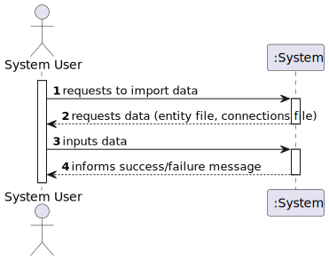
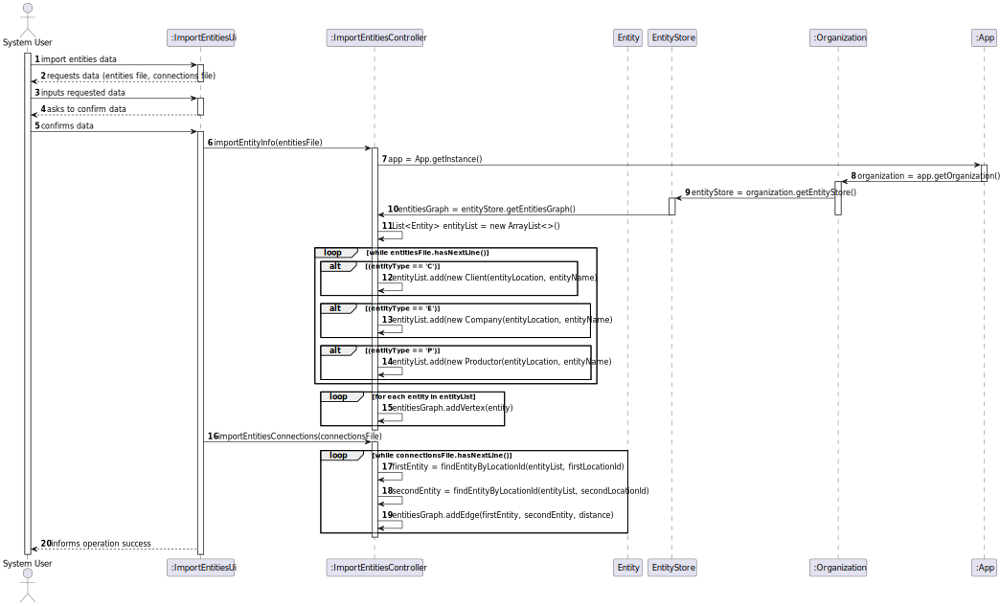
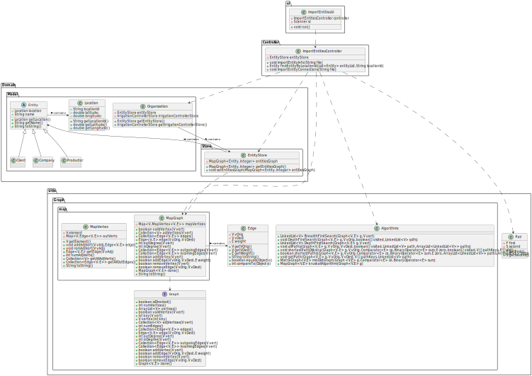

# US 301 - Construir a rede de distribuição de cabazes a partir da informação fornecida nos ficheiros.

## 1. Requirements Engineering

### 1.1. User Story Description
*Construir a rede de distribuição de cabazes a partir da informação fornecida nos
ficheiros. O grafo deve ser implementado usando a representação mais adequada e garantindo a
manipulação indistinta dos clientes/empresas e produtores agrícolas (código cliente: C, código
empresa: E, código produtor: P).*

### 1.2. Acceptance Criteria

* **Acceptance Criteria 1:** Created graph contains all nodes and edges from the input files.

### 1.3. Found out Dependencies

- *No dependencies found.*

### 1.4 Input and Output Data

**Input data:**

* Typed data:
    * File path containing the entities to import
    * file containing the connections to import

**Output data:**

* (In)Success of the operation

### 1.5. System Sequence Diagram (SSD)

### 1.6 Other Relevant Remarks

*Every entity is going to be saved on the same network, regardless of the entity type.*

## 2. OO Analysis

### 2.1. Relevant Domain Model Excerpt

## 3. Design - User Story Realization

### 3.1. Rationale

### Systematization ##

According to the taken rationale, the conceptual classes promoted to software classes are:

* Organization
* Client
* Productor
* Company

Software classes (i.e. Pure Fabrication) identified:

* Entity
* EntityStore
* ImportEntitiesController
* ImportEntitiesUi
* Location
* MapGraph
* MapVertex
* Edge
* Algorithms
* Pair

## 3.2. Sequence Diagram (SD)

## 3.3. Class Diagram (CD)

 
# 4. Tests

**Test 1** Check if importEntityInfo works when there are no entities in the file

	@Test
    void noEntitiesTest() throws FileNotFoundException {
        resetGraph();
        controller.importEntityInfo("src/test/resources/Entities/no_entities_test.csv");
        assertEquals(0, testMapGraph.numVertices());
    }

**Test 2** Check if importEntityConnections works when there are no connections in the file

	@Test
    void noConnectionsTest() throws FileNotFoundException {
        resetGraph();
        controller.importEntityConnections("src/test/resources/Entities/no_connections_test.csv");
        assertEquals(0, testMapGraph.numEdges());
    }

**Test 3:** Check if importEntityInfo and importEntityConnections work correctly when there is only one connection in the file

	@Test
    void oneConnectionTest() throws FileNotFoundException {
        resetGraph();
        controller.importEntityInfo("src/test/resources/Entities/two_entities_test.csv");
        controller.importEntityConnections("src/test/resources/Entities/one_connection_test.csv");
        assertEquals(2, testMapGraph.numEdges());
    }

**Test 4:** Check if importEntityInfo works correctly when there are only two entities in the file

	@Test
    void twoEntitiesTest() throws FileNotFoundException {
        resetGraph();
        controller.importEntityInfo("src/test/resources/Entities/two_entities_test.csv");
        assertEquals(2, testMapGraph.numVertices());
    }

**Test 5:** Check if findEntityByLocationId works finds the correct entities as expected

	@Test
    void findEntityByLocationIdTest() throws FileNotFoundException {
        resetGraph();
        controller.importEntityInfo("src/test/resources/Entities/two_entities_test.csv");
        controller.importEntityConnections("src/test/resources/Entities/one_connection_test.csv");
        List<Entity> entityList = testMapGraph.vertices(); // get all the entities from the graph
        Entity firstEntity = controller.findEntityByLocationId(entityList, "CT1");
        Entity secondEntity = controller.findEntityByLocationId(entityList, "CT2");
        assertEquals(firstEntity, entityList.get(0));
        assertEquals(secondEntity, entityList.get(1));
    }

# 5. Construction (Implementation)

## class ImportEntitiesController

	public class ImportEntitiesController {

    private EntityStore     entityStore;
    public ImportEntitiesController() {
        this.entityStore = App.getInstance().getOrganization().getEntityStore();
    }

    /**
     * Imports the entity information from a file to entityStore
     * @param file the file to import from
     * @throws FileNotFoundException if the file is not found
     */
    public void importEntityInfo(String file) throws FileNotFoundException {
        List<Entity> entityList = new ArrayList<>(); // list containing all the entities
        Scanner sc = new Scanner(new File(file));
        int lineNumber = 1;
        sc.nextLine(); // skip header
        while (sc.hasNextLine()) {
            try {
                String line = sc.nextLine();
                String[] elements = line.split(",");
                Location entityLocation = new Location(elements[0], Double.parseDouble(elements[1]), Double.parseDouble(elements[2]));
                char entityType = elements[3].charAt(0); // get the first character of the string to distinguish between the different types of entities
                switch (entityType){
                    case 'C': // if the entity is a client
                        entityList.add(new Client(entityLocation, elements[3]));
                        break;
                    case 'E': // if the entity is a company
                        entityList.add(new Company(entityLocation, elements[3]));
                        break;
                    case 'P': // if the entity is a productor
                        entityList.add(new Productor(entityLocation, elements[3]));
                        break;
                }
            } catch (Exception e) {
                System.out.printf("Error in line: %d %s ", lineNumber, e.getCause());
            }
            lineNumber++;
        }

        MapGraph<Entity, Integer> entitiesGraph = entityStore.getEntitiesGraph();
        for (Entity e : entityList) {
            entitiesGraph.addVertex(e);
        }

    }

    /**
     * Finds the correct entity object, given its location id
     * @param entityList list of entities
     * @param locationId location id of the entity
     * @return the entity object
     */
    public Entity findEntityByLocationId(List<Entity> entityList, String locationId){
        for (Entity e : entityList) {
            if (e.getLocation().getLocationId().equals(locationId)) {
                return e;
            }
        }
        return null;
    }

    /**
     * Imports the entity connections from a file and adds them to the entityStore
     * @param file the file to import from
     * @throws FileNotFoundException if the file is not found
     */
    public void importEntityConnections(String file) throws FileNotFoundException {
        Scanner sc = new Scanner(new File(file));
        int lineNumber = 1;
        sc.nextLine(); // skip header
        while (sc.hasNextLine()) {
            try {
                String line = sc.nextLine();
                String[] elements = line.split(",");
                String firstLocationId = elements[0]; // location id of the first entity
                String secondLocationId = elements[1]; // location id of the second entity
                int distance = Integer.parseInt(elements[2]); // distance between the two locations
                MapGraph<Entity, Integer> entitiesGraph = entityStore.getEntitiesGraph();
                List<Entity> entityList = entitiesGraph.vertices(); // get all the entities from the graph
                Entity firstEntity = findEntityByLocationId(entityList, firstLocationId); // find the first entity by location id
                Entity secondEntity = findEntityByLocationId(entityList, secondLocationId); // find the second entity by location id
                entitiesGraph.addEdge(firstEntity, secondEntity, distance); // add the edge to the graph
            } catch (Exception e) {
                System.out.printf("Error in line: %d %s ", lineNumber, e.getCause());
            }
            lineNumber++;
        }
    }

}

## class ImportEntitiesUi

	public class ImportEntitiesUi implements Runnable {

    Controller.ImportEntitiesController controller;
    public ImportEntitiesUi(){
        controller = new Controller.ImportEntitiesController();
    }

    Scanner sc = new Scanner(System.in);

    @Override
    public void run(){
        System.out.println("Import Data");
        System.out.println("Insert file containing the entities to import: "); // file containing entity locations and coordinates
        String file = sc.nextLine();
        try {
            controller.importEntityInfo(file);
        } catch (FileNotFoundException e) {
            System.out.println("File not found");
        }

        System.out.println("Insert file containing the connections to import: "); // file containing the distances between locations
        file = sc.nextLine();
        try {
            controller.importEntityConnections(file);
        } catch (FileNotFoundException e) {
            System.out.println("File not found");
        }

        System.out.println("Data imported successfully!");
        System.out.println();

    }

# 6. Integration and Demo

* A new option on the main menu options was added.

# 7. Observations

* No observations were made.

