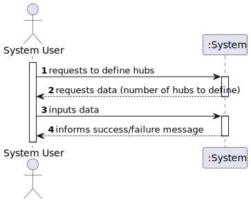
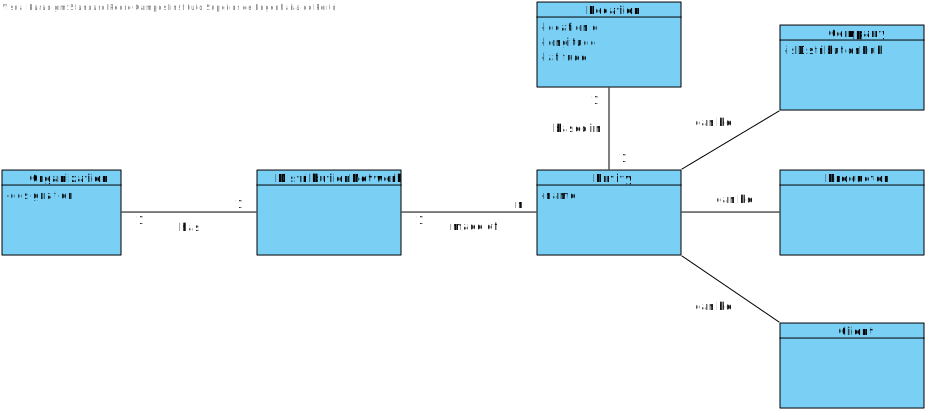
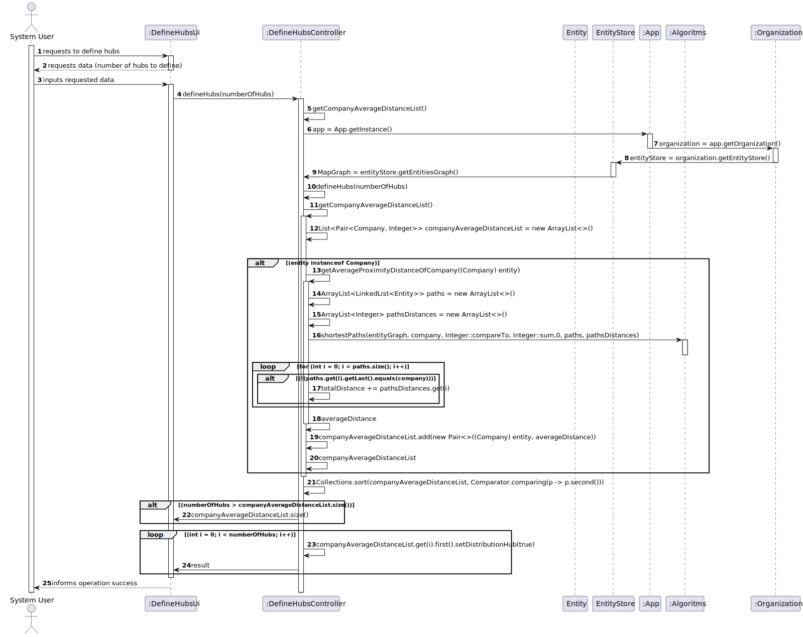
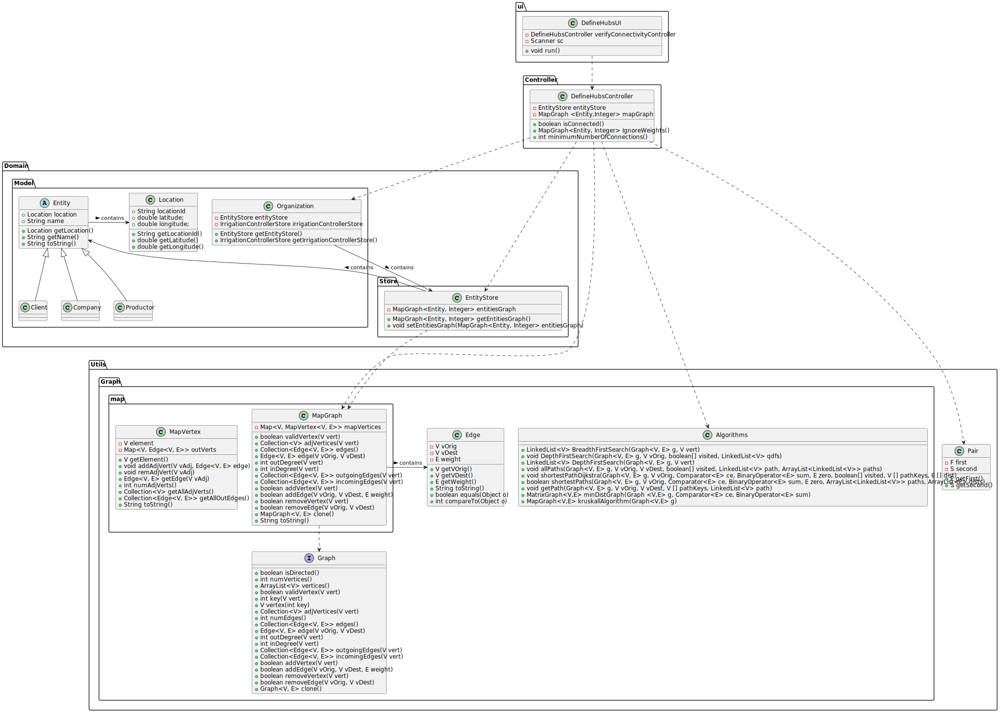

# US 303 - Definir os hubs da rede de distribuição

## 1. Requirements Engineering

### 1.1. User Story Description
*Definir os hubs da rede de distribuição, ou seja, encontrar as N empresas mais próximas de
todos os pontos da rede (clientes e produtores agrícolas). A medida de proximidade deve ser
calculada como a média do comprimento do caminho mais curto de cada empresa a todos os
clientes e produtores agrícolas.*

### 1.2. Acceptance Criteria

* **Acceptance Criteria 1:** The proximity measurement should be
  calculated as the average length of the shortest path from each firm to all
  customers and agricultural producers.

### 1.3. Found out Dependencies

- *No dependencies found.*

### 1.4 Input and Output Data

**Input data:**

* Typed data:
    * Number of hubs we want to define
  
**Output data:**

* (In)Success of the operation

### 1.5. System Sequence Diagram (SSD)

### 1.6 Other Relevant Remarks

- *No relavant remarks found.*

## 2. OO Analysis

### 2.1. Relevant Domain Model Excerpt

## 3. Design - User Story Realization

### 3.1. Rationale

### Systematization ##

According to the taken rationale, the conceptual classes promoted to software classes are:

* Organization
* Client
* Productor
* Company

Software classes (i.e. Pure Fabrication) identified:

* Entity
* EntityStore
* DefineHubsController
* DefineHubsUi
* Location
* MapGraph
* Edge
* Algorithms
* Pair

## 3.2. Sequence Diagram (SD)

## 3.3. Class Diagram (CD)

# 4. Tests

**Test 1** Check the average proximity distance of company 

	@Test
    void getAverageProximityDistanceOfCompanyTest() {
        resetGraph();
        testMapGraph.addVertex(client1);
        testMapGraph.addVertex(client2);
        testMapGraph.addVertex(client3);
        testMapGraph.addVertex(comp1);
        testMapGraph.addVertex(comp2);
        testMapGraph.addEdge(client1, comp1, 10);
        testMapGraph.addEdge(client2, comp1, 10);
        testMapGraph.addEdge(client3, comp1, 10);
        testMapGraph.addEdge(client1, comp2, 20);
        testMapGraph.addEdge(client2, comp2, 20);
        testMapGraph.addEdge(client3, comp2, 20);
        testMapGraph.addEdge(comp1, comp2, 15);

        int distance = controller.getAverageProximityDistanceOfCompany(comp1);
        int distance2 = controller.getAverageProximityDistanceOfCompany(comp2);

        assertEquals(11, distance);
        assertEquals(18, distance2);
    }

**Test 2** Check the list of company average distance. 

	@Test
    void getCompanyAverageDistanceListTest() {
        resetGraph();
        testMapGraph.addVertex(client1);
        testMapGraph.addVertex(client2);
        testMapGraph.addVertex(client3);
        testMapGraph.addVertex(comp1);
        testMapGraph.addVertex(comp2);
        testMapGraph.addEdge(client1, comp1, 10);
        testMapGraph.addEdge(client2, comp1, 10);
        testMapGraph.addEdge(client3, comp1, 10);
        testMapGraph.addEdge(client1, comp2, 20);
        testMapGraph.addEdge(client2, comp2, 20);
        testMapGraph.addEdge(client3, comp2, 20);
        testMapGraph.addEdge(comp1, comp2, 15);

        List<Pair<Company, Integer>> companyAverageDistanceList = controller.getCompanyAverageDistanceList();

        assertEquals(2, companyAverageDistanceList.size());
        assertEquals(11, companyAverageDistanceList.get(0).second());
        assertEquals(18, companyAverageDistanceList.get(1).second());
    }

**Test 3:** Verify the defined hubs

	@Test
    void defineHubsTest() {
        resetGraph();
        testMapGraph.addVertex(client1);
        testMapGraph.addVertex(client2);
        testMapGraph.addVertex(client3);
        testMapGraph.addVertex(comp1);
        testMapGraph.addVertex(comp2);
        testMapGraph.addEdge(client1, comp1, 10);
        testMapGraph.addEdge(client2, comp1, 10);
        testMapGraph.addEdge(client3, comp1, 10);
        testMapGraph.addEdge(client1, comp2, 20);
        testMapGraph.addEdge(client2, comp2, 20);
        testMapGraph.addEdge(client3, comp2, 20);
        testMapGraph.addEdge(comp1, comp2, 15);

        controller.defineHubs(1);
        assertTrue(comp1.isDistributionHub());
        assertFalse(comp2.isDistributionHub());
    }

# 5. Construction (Implementation)

## class DefineHubsController

	public class DefineHubsController {

    private EntityStore entityStore;

    public DefineHubsController() {
        this.entityStore = App.getInstance().getOrganization().getEntityStore();
    }

    /**
     * Method to get the average proximity distance to all other entities for a respective company
     * @param company the company to get the average proximity distance to all other entities
     * @return the average proximity distance to all other entities
     */
    public int getAverageProximityDistanceOfCompany(Company company) {
        MapGraph<Entity, Integer> entityGraph = entityStore.getEntitiesGraph();
        int totalDistance = 0;

        ArrayList<LinkedList<Entity>> paths = new ArrayList<>();
        ArrayList<Integer> pathsDistances = new ArrayList<>();

        Algorithms.shortestPaths(entityGraph, company, Integer::compareTo, Integer::sum,0, paths, pathsDistances);
        for (int i = 0; i < paths.size(); i++) {
            if (!(paths.get(i).getLast().equals(company))) {
                totalDistance += pathsDistances.get(i);
            }

        }
        int averageDistance = totalDistance / (paths.size() - 1);

        return averageDistance;
    }

    /**
     * Method to get a list of all companies with their respective average proximity distance to all other entities
     * @return a list of pairs with the companies and their respective average proximity distance to all other entities
     */
    public List<Pair<Company, Integer>> getCompanyAverageDistanceList() {
        List<Pair<Company, Integer>> companyAverageDistanceList = new ArrayList<>();

        for (Entity entity : entityStore.getEntitiesGraph().vertices()) {
            if (entity instanceof Company) {
                int averageDistance = getAverageProximityDistanceOfCompany((Company) entity);
                companyAverageDistanceList.add(new Pair<>((Company) entity, averageDistance));
            }

        }
        return companyAverageDistanceList;
    }

    /**
     * Method to define the n companies with the lowest average proximity distance to all other entities as Distribution Hubs
     */
    public void defineHubs(int numberOfHubs) {

        List<Pair<Company, Integer>> companyAverageDistanceList = getCompanyAverageDistanceList();
        Collections.sort(companyAverageDistanceList, Comparator.comparing(p -> p.second()));
        if (numberOfHubs > companyAverageDistanceList.size()) {
            numberOfHubs = companyAverageDistanceList.size();
            System.out.println("Number of hubs is greater than the number of companies, setting number of hubs to " + numberOfHubs);
        }

        for (int i = 0; i < numberOfHubs; i++) {
            companyAverageDistanceList.get(i).first().setDistributionHub(true);
            System.out.println("Company " + companyAverageDistanceList.get(i).first().getName() + " is now a distribution hub with a average distribution distance of " + companyAverageDistanceList.get(i).second() + " meters");
        }
    }

# 6. Integration and Demo

* Now is possible to define distribution hubs.

# 7. Observations

* no relavant observations

