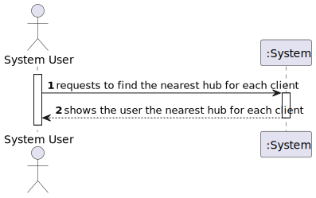
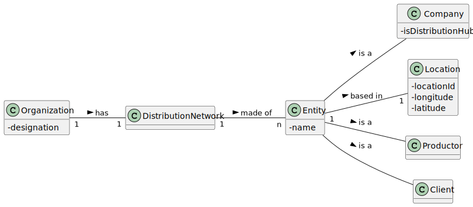
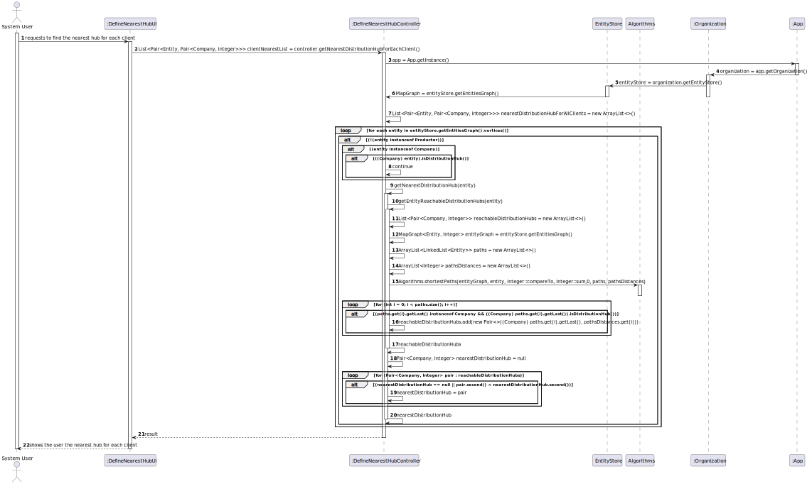
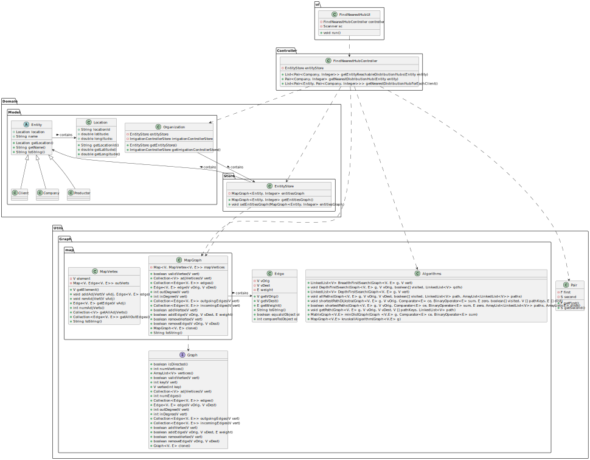

# US 304 - I intend to find the nearest hub for each client.

## 1. Requirements Engineering

### 1.1. User Story Description

*For each client (particular or company) determine the nearest hub.*

### 1.2. Acceptance Criteria

* **Acceptance Criteria 1:** The hub presented to each client must be the nearest to that client.

### 1.3. Found out Dependencies

- *There is a dependency to "US301 Build a distribution network of hampers" since you need the graph to be loaded in order to have clients and companies defined.*
- *There is a dependency to "US303 Define hubs for the distribution network" since you need the hubs to be defined in order to find the nearest to each client.*

### 1.4 Input and Output Data

**Input data:**

* n/A

**Output data:**

* The nearest defined hub to each client loaded in the distribution network.
* (In)Success of the operation

### 1.5. System Sequence Diagram (SSD)

### 1.6 Other Relevant Remarks

*n/A*

## 2. OO Analysis

### 2.1. Relevant Domain Model Excerpt

## 3. Design - User Story Realization

### 3.1. Rationale

### Systematization ##

According to the taken rationale, the conceptual classes promoted to software classes are:

* Organization
* Client
* Productor
* Company

Software classes (i.e. Pure Fabrication) identified:

* Entity
* EntityStore
* FindNearestHubController
* FindNearestHubUI
* MapGraph
* MapVertex
* Edge
* Algorithms
* Pair
* Location

## 3.2. Sequence Diagram (SD)

## 3.3. Class Diagram (CD)

# 4. Tests

    EntityStore entityStore = App.getInstance().getOrganization().getEntityStore();
    FindNearestHubController controller = new FindNearestHubController();
    DefineHubsController defineHubsController = new DefineHubsController();
    MapGraph<Entity, Integer> emptyMapGraph = new MapGraph<>(false);
    MapGraph<Entity, Integer> testMapGraph = new MapGraph<>(false);

    Client client1 = new Client(new Location("id1", 99.1, 100.1), "client1");
    Client client2 = new Client(new Location("id2", 99.2, 100.2), "client2");
    Client client3 = new Client(new Location("id3", 99.3, 100.3), "client3");
    Company comp1 = new Company(new Location("id4", 99.4, 100.4), "comp1");
    Company comp2 = new Company(new Location("id5", 99.5, 100.5), "comp2");

    void resetGraph() {
        testMapGraph = emptyMapGraph.clone();
        entityStore.setEntitiesGraph(testMapGraph);
        MapGraph<Entity, Integer> testMapGraph = entityStore.getEntitiesGraph();
    }

**Test 1** Check if the reachable distribution hubs are found correctly 

	@Test
    void getEntityReachableDistributionHubs() {
        resetGraph();
        testMapGraph.addVertex(client1);
        testMapGraph.addVertex(client2);
        testMapGraph.addVertex(client3);
        testMapGraph.addVertex(comp1);
        testMapGraph.addVertex(comp2);
        testMapGraph.addEdge(client1, comp1, 10);
        testMapGraph.addEdge(client2, comp1, 10);
        testMapGraph.addEdge(client3, comp1, 10);
        testMapGraph.addEdge(client1, comp2, 20);
        testMapGraph.addEdge(client2, comp2, 20);
        testMapGraph.addEdge(client3, comp2, 20);
        testMapGraph.addEdge(comp1, comp2, 10);

        defineHubsController.defineHubs(2);

        List<Pair<Company, Integer>> hubList = controller.getEntityReachableDistributionHubs(client1);
        assertEquals(2, hubList.size());
        assertEquals(10, hubList.get(0).second());
        assertEquals(20, hubList.get(1).second());

    }

**Test 2** Check if the nearest distribution hub is found correctly

	@Test
    void getNearestDistributionHub() {
        resetGraph();
        testMapGraph.addVertex(client1);
        testMapGraph.addVertex(client2);
        testMapGraph.addVertex(client3);
        testMapGraph.addVertex(comp1);
        testMapGraph.addVertex(comp2);
        testMapGraph.addEdge(client1, comp1, 10);
        testMapGraph.addEdge(client2, comp1, 10);
        testMapGraph.addEdge(client3, comp1, 10);
        testMapGraph.addEdge(client1, comp2, 20);
        testMapGraph.addEdge(client2, comp2, 20);
        testMapGraph.addEdge(client3, comp2, 20);
        testMapGraph.addEdge(comp1, comp2, 10);

        defineHubsController.defineHubs(2);

        Pair<Company, Integer> nearestHub = controller.getNearestDistributionHub(client1);

        assertEquals(comp1, nearestHub.first());
        assertEquals(10, nearestHub.second());
    }

**Test 3:** Check if the nearest hub for each client is found correctly

	@Test
    void getNearestDistributionHubForEachClient() {
        resetGraph();
        testMapGraph.addVertex(client1);
        testMapGraph.addVertex(client2);
        testMapGraph.addVertex(client3);
        testMapGraph.addVertex(comp1);
        testMapGraph.addVertex(comp2);
        testMapGraph.addEdge(client1, comp1, 10);
        testMapGraph.addEdge(client2, comp1, 10);
        testMapGraph.addEdge(client3, comp1, 10);
        testMapGraph.addEdge(client1, comp2, 20);
        testMapGraph.addEdge(client2, comp2, 20);
        testMapGraph.addEdge(client3, comp2, 5);
        testMapGraph.addEdge(comp1, comp2, 10);

        defineHubsController.defineHubs(2);

        List<Pair<Entity, Pair<Company, Integer>>> nearestHubForEachClient = controller.getNearestDistributionHubForEachClient();

        assertEquals(3, nearestHubForEachClient.size());

        assertEquals(client1, nearestHubForEachClient.get(0).first());
        assertEquals(comp1, nearestHubForEachClient.get(0).second().first());
        assertEquals(10, nearestHubForEachClient.get(0).second().second());

        assertEquals(client2, nearestHubForEachClient.get(1).first());
        assertEquals(comp1, nearestHubForEachClient.get(1).second().first());
        assertEquals(10, nearestHubForEachClient.get(1).second().second());

        assertEquals(client3, nearestHubForEachClient.get(2).first());
        assertEquals(comp2, nearestHubForEachClient.get(2).second().first());
        assertEquals(5, nearestHubForEachClient.get(2).second().second());

    }

# 5. Construction (Implementation)

## class FindNearestController

    public class FindNearestHubController {

    private EntityStore entityStore;

    public FindNearestHubController() {
        this.entityStore = App.getInstance().getOrganization().getEntityStore();
    }

    /**
     * Method to get a list of reachable Distribution Hubs from a given entity with the respective path distance
     * @param entity the entity to find the Distribution Hubs from
     * @return a list of pairs with the reachable Distribution Hubs and the distance to each one
     */
    public List<Pair<Company, Integer>> getEntityReachableDistributionHubs(Entity entity) {
        List<Pair<Company, Integer>> reachableDistributionHubs = new ArrayList<>();
        MapGraph<Entity, Integer> entityGraph = entityStore.getEntitiesGraph();
        ArrayList<LinkedList<Entity>> paths = new ArrayList<>();
        ArrayList<Integer> pathsDistances = new ArrayList<>();

        Algorithms.shortestPaths(entityGraph, entity, Integer::compareTo, Integer::sum,0, paths, pathsDistances);
        for (int i = 0; i < paths.size(); i++) {
            if (paths.get(i).getLast() instanceof Company && ((Company) paths.get(i).getLast()).isDistributionHub()) {
                reachableDistributionHubs.add(new Pair<>((Company) paths.get(i).getLast(), pathsDistances.get(i)));
            }
        }

        return reachableDistributionHubs;
    }

    /**
     * Method to get the nearest Distribution Hub to a given entity
     * @param entity the entity to find the nearest Distribution Hub from
     * @return a pair with the nearest company and the distance to it
     */
    public Pair<Company, Integer> getNearestDistributionHub(Entity entity) {
        List<Pair<Company, Integer>> reachableDistributionHubs = getEntityReachableDistributionHubs(entity);
        Pair<Company, Integer> nearestDistributionHub = null;
        for (Pair<Company, Integer> pair : reachableDistributionHubs) {
            if (nearestDistributionHub == null || pair.second() < nearestDistributionHub.second()) {
                nearestDistributionHub = pair;
            }
        }
        return nearestDistributionHub;
    }

    /**
     * Method to get the nearest Distribution Hub for each client
     * @return a list of pairs with the nearest Distribution Hub for each client and the distance to it
     */

    public List<Pair<Entity, Pair<Company, Integer>>> getNearestDistributionHubForEachClient() {
        List<Pair<Entity, Pair<Company, Integer>>> nearestDistributionHubForAllClients = new ArrayList<>();
        for (Entity entity : entityStore.getEntitiesGraph().vertices()) {
            if (!(entity instanceof Productor)) {
                if(entity instanceof Company){
                    if(((Company) entity).isDistributionHub()){
                        continue;
                    }
                }
                nearestDistributionHubForAllClients.add(new Pair<>(entity, getNearestDistributionHub(entity)));
            }
        }
        return nearestDistributionHubForAllClients;
    }

    }

    

## class FindNearestHubUI

	public class FindNearestHubUi implements Runnable {

    FindNearestHubController controller;

    public FindNearestHubUi(){
        controller = new FindNearestHubController();
    }

    Scanner sc = new Scanner(System.in);

    @Override
    public void run() {

        List<Pair<Entity, Pair<Company, Integer>>> clientNearestList = controller.getNearestDistributionHubForEachClient();

        System.out.println("Nearest Distribution Hub for each client: ");
        for (Pair<Entity, Pair<Company, Integer>> pair : clientNearestList) {
            System.out.println("Nearest Distribution Hub to " + pair.first().getName() + " is " + pair.second().first().getName() + " with a distance of " + pair.second().second() + " meters");
        }

        System.out.println();

    }
    }

## Class EntityStore

    public class EntityStore {

    private MapGraph<Entity, Integer> entitiesGraph;

    public EntityStore() {
        this.entitiesGraph = new MapGraph<>(false);
    }

    public MapGraph<Entity, Integer> getEntitiesGraph() {
        return entitiesGraph;
    }

    public void setEntitiesGraph(MapGraph<Entity, Integer> entitiesGraph) {
        this.entitiesGraph = entitiesGraph;
    }
    }

## Class Algorithms

    public class Algorithms {

    public static <V,E> MapGraph<V,E> kruskallAlgorithm(Graph<V,E> g) {
        MapGraph<V,E> graph = new MapGraph<>(false);
        List<Edge<V,E>> listEdges = new ArrayList<>();
        for (V org : g.vertices()){
            graph.addVertex(org);
        }
        for (Edge<V,E> edge : g.edges()){
            listEdges.add(edge);
        }
        Collections.sort(listEdges);
        LinkedList<V> connectedVerts = new LinkedList<>();
        for (Edge<V,E> edge : listEdges){
            connectedVerts = DepthFirstSearch(graph, edge.getVOrig());
            if(!connectedVerts.contains(edge.getVDest())){
                graph.addEdge(edge.getVOrig(),edge.getVDest(),edge.getWeight());
            }
        }
        return graph;
    }
    

    /** Performs breadth-first search of a Graph starting in a vertex
     *
     * @param g Graph instance
     * @param vert vertex that will be the source of the search
     * @return a LinkedList with the vertices of breadth-first search
     */
    public static <V, E> LinkedList<V> BreadthFirstSearch(Graph<V, E> g, V vert) {
        if(!g.validVertex(vert))
            return null;

        LinkedList<V> quaux = new LinkedList<>();
        LinkedList<V> qbls = new LinkedList<>();
        boolean[] visited = new boolean[g.numVertices()];
        quaux.add(vert); qbls.add(vert);
        int vkey = g.key(vert);
        visited[vkey] = true;

        while(!quaux.isEmpty()) {
            vert = quaux.remove();
            for(V vAdj : g.adjVertices(vert)) {
                vkey = g.key(vAdj);
                if(!visited[vkey]) {
                    quaux.add(vAdj);
                    visited[vkey] = true;
                    qbls.add(vAdj);
                }
            }
        }
        return qbls;
    }

    /** Performs depth-first search starting in a vertex
     *
     * @param g Graph instance
     * @param vOrig vertex of graph g that will be the source of the search
     * @param visited set of previously visited vertices
     * @param qdfs return LinkedList with vertices of depth-first search
     */
    private static <V, E> void DepthFirstSearch(Graph<V, E> g, V vOrig, boolean[] visited, LinkedList<V> qdfs) {
        visited[g.key(vOrig)] = true;

        for (V vertex : g.adjVertices(vOrig)) {
            if (! visited[g.key(vertex)]) {
                qdfs.add(vertex);
                DepthFirstSearch(g, vertex, visited, qdfs);
            }
        }
    }

    /** Performs depth-first search starting in a vertex
     *
     * @param g Graph instance
     * @param vert vertex of graph g that will be the source of the search
     * @return a LinkedList with the vertices of depth-first search
     */
    public static <V, E> LinkedList<V> DepthFirstSearch(Graph<V, E> g, V vert) {
        if (!g.validVertex(vert)) {
            return null;
        }

        LinkedList<V> resultLinkedList = new LinkedList<>();
        resultLinkedList.add(vert);
        boolean[] knownVertices = new boolean[g.numVertices()];

        DepthFirstSearch(g, vert, knownVertices, resultLinkedList);

        return resultLinkedList;
    }

    /** Returns all paths from vOrig to vDest
     *
     * @param g       Graph instance
     * @param vOrig   Vertex that will be the source of the path
     * @param vDest   Vertex that will be the end of the path
     * @param visited set of discovered vertices
     * @param path    stack with vertices of the current path (the path is in reverse order)
     * @param paths   ArrayList with all the paths (in correct order)
     */
    private static <V, E> void allPaths(Graph<V, E> g, V vOrig, V vDest, boolean[] visited,
                                        LinkedList<V> path, ArrayList<LinkedList<V>> paths) {

        int vKey = g.key(vOrig);
        if (visited[vKey]) return;

        if (vOrig.equals(vDest)) {         
            LinkedList<V> pathcopy = new LinkedList<>(path);
            pathcopy.addFirst(vDest);
            Collections.reverse(pathcopy);
            paths.add(new LinkedList<>(pathcopy));
            return;
        }

        path.push(vOrig);
        visited[vKey] = true;

        for (V vAdj : g.adjVertices(vOrig)) {
            allPaths(g, vAdj, vDest, visited, path, paths);
        }

        path.pop();
        visited[vKey] = false;
    }

    /** Returns all paths from vOrig to vDest
     *
     * @param graph     Graph instance
     * @param vOrig information of the Vertex origin
     * @param vDest information of the Vertex destination
     * @return paths ArrayList with all paths from vOrig to vDest
     */
    public static <V, E> ArrayList<LinkedList<V>> allPaths(Graph<V, E> graph, V vOrig, V vDest) {

        LinkedList<V> path = new LinkedList<>();
        ArrayList<LinkedList<V>> paths = new ArrayList<>();
        boolean[] visited = new boolean[graph.numVertices()];

        if (graph.validVertex(vOrig) && graph.validVertex(vDest))
            allPaths(graph, vOrig, vDest, visited, path, paths);

        return paths;
    }

    /**
     * Computes shortest-path distance from a source vertex to all reachable
     * vertices of a graph g with non-negative edge weights
     * This implementation uses Dijkstra's algorithm
     *
     * @param g        Graph instance
     * @param vOrig    Vertex that will be the source of the path
     * @param visited  set of previously visited vertices
     * @param pathKeys minimum path vertices keys
     * @param dist     minimum distances
     */
    //resolução professora
    private static <V, E> void shortestPathDijkstra(Graph<V, E> g, V vOrig,
                                                    Comparator<E> ce, BinaryOperator<E> sum, E zero,
                                                    boolean[] visited, V [] pathKeys, E [] dist) {
        int vKey = g.key(vOrig);
        dist[vKey] = zero;
        pathKeys[vKey] = vOrig;

        while(vOrig != null) {
            vKey = g.key(vOrig);
            visited[vKey] = true;
            for (Edge<V, E> edge : g.outgoingEdges(vOrig)) {
                int verticeKeyAdjacent = g.key(edge.getVDest());
                if(!visited[verticeKeyAdjacent]) {
                    E s = sum.apply(dist[vKey], edge.getWeight());
                    if(dist[verticeKeyAdjacent] == null || ce.compare(dist[verticeKeyAdjacent], s) > 0) {
                        dist[verticeKeyAdjacent] = s;
                        pathKeys[verticeKeyAdjacent] = vOrig;
                    }
                }

            }
            E minDist = null;
            vOrig = null;
            for (V vert : g.vertices()) {
                int i = g.key(vert);
                if(!visited[i] && dist[i] != null && (minDist == null || ce.compare(dist[i], minDist) < 0)) {
                    minDist = dist[i];
                    vOrig = vert;
                }
            }
        }
    }

    /** Calculates the minimum distance graph using Floyd-Warshall
     *
     * @param g initial graph
     * @param ce comparator between elements of type E
     * @param sum sum two elements of type E
     * @return the minimum distance graph
     */
    public static <V,E> MatrixGraph<V,E> minDistGraph(Graph <V,E> g, Comparator<E> ce, BinaryOperator<E> sum) {
        int numVerts = g.numVertices();
        if(numVerts == 0)
            return null;

        E[][] mat = (E[][]) new Object[numVerts][numVerts];
        for (int i = 0; i < numVerts; i++) {
            for (int j = 0; j < numVerts; j++) {
                Edge<V,E> edge = g.edge(i,j);
                if(edge != null)
                    mat[i][j] = edge.getWeight();
            }
        }
        for (int k = 0; k < numVerts; k++) {
            for (int i = 0; i < numVerts; i++) {
                if(i != k && mat[i][k] != null) {
                    for (int j = 0; j < numVerts; j++) {
                        if(j != k && j != i && mat[k][j] != null) {
                            E s = sum.apply(mat[i][k], mat[k][j]);
                            if(mat[i][j] == null || ce.compare(mat[i][j],s) > 0) {
                                mat[i][j] = s;
                            }
                        }
                    }
                }
            }
        }
        return new MatrixGraph<>(g.isDirected(), g.vertices(), mat);

    }

    /** Shortest-path between two vertices
     *
     * @param g graph
     * @param vOrig origin vertex
     * @param vDest destination vertex
     * @param ce comparator between elements of type E
     * @param sum sum two elements of type E
     * @param zero neutral element of the sum in elements of type E
     * @param shortPath returns the vertices which make the shortest path
     * @return if vertices exist in the graph and are connected, true, false otherwise
     */
    public static <V, E> E shortestPath(Graph<V, E> g, V vOrig, V vDest, Comparator<E> ce, BinaryOperator<E> sum, E zero, LinkedList<V> shortPath) {
        if(!g.validVertex(vOrig) || !g.validVertex(vDest)) {
            return null;
        }

        shortPath.clear();
        int numVerts = g.numVertices();
        boolean[] visited = new boolean[numVerts];
        @SuppressWarnings("unchecked")
        V[] pathkeys = (V[]) new Object[numVerts];
        @SuppressWarnings("unchecked")
        E[] dist = (E[]) new Object[numVerts];

        for (int i = 0; i < numVerts; i++) {
            dist[i] = null;
            pathkeys[i] = null;
        }

        shortestPathDijkstra(g, vOrig, ce, sum, zero, visited, pathkeys, dist);

        E lengthPath = dist[g.key(vDest)]; //para saber se conseguimos alcançar o vértice destino

        if(lengthPath == null)
            return null;

        getPath(g, vOrig, vDest, pathkeys, shortPath);
        return lengthPath;
    }

    /** Shortest-path between a vertex and all other vertices
     *
     * @param g graph
     * @param vOrig start vertex
     * @param ce comparator between elements of type E
     * @param sum sum two elements of type E
     * @param zero neutral element of the sum in elements of type E
     * @param paths returns all the minimum paths
     * @param dists returns the corresponding minimum distances
     * @return if vOrig exists in the graph true, false otherwise
     */
    public static <V, E> boolean shortestPaths(Graph<V, E> g, V vOrig, Comparator<E> ce, BinaryOperator<E> sum, E zero, ArrayList<LinkedList<V>> paths, ArrayList<E> dists) {
        if(!g.validVertex(vOrig)) {
            return false;
        }

        dists.clear();
        paths.clear();

        int numVerts = g.numVertices();

        for (int i = 0; i < numVerts; i++) {
            dists.add(null);
            paths.add(null);
        }

        boolean[] visited = new boolean[numVerts];
        @SuppressWarnings("unchecked")
        V[] pathkeys = (V[]) new Object[numVerts];
        @SuppressWarnings("unchecked")
        E[] dist = (E[]) new Object[numVerts];

        for (int i = 0; i < numVerts; i++) {
            dist[i] = null;
            pathkeys[i] = null;
        }

        shortestPathDijkstra(g, vOrig, ce, sum, zero, visited, pathkeys, dist);

        for (V vDest : g.vertices()) {
            int v = g.key(vDest);
            if(dist[v] != null) {
                LinkedList<V> shortPath = new LinkedList<>();
                getPath(g, vOrig, vDest, pathkeys, shortPath);
                paths.set(v, shortPath);
                dists.set(v, dist[v]);
            }
        }
        return true;
    }

    /**
     * Extracts from pathKeys the minimum path between voInf and vdInf
     * The path is constructed from the end to the beginning
     *
     * @param g        Graph instance
     * @param vOrig    information of the Vertex origin
     * @param vDest    information of the Vertex destination
     * @param pathKeys minimum path vertices keys
     * @param path     stack with the minimum path (correct order)
     */
    private static <V, E> void getPath(Graph<V, E> g, V vOrig, V vDest, V [] pathKeys, LinkedList<V> path) {
        if(vDest.equals(vOrig)) {
            path.push(vDest);
        } else {
            path.push(vDest);
            int vKey = g.key(vDest);
            vDest = pathKeys[vKey];
            getPath(g,vOrig,vDest,pathKeys,path);
        }
    }
    }

# 6. Integration and Demo

* It is now possible to find the nearest hub for each client loaded in the distribution network.

# 7. Observations

* There are no relevant observations.

