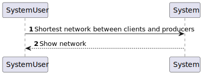
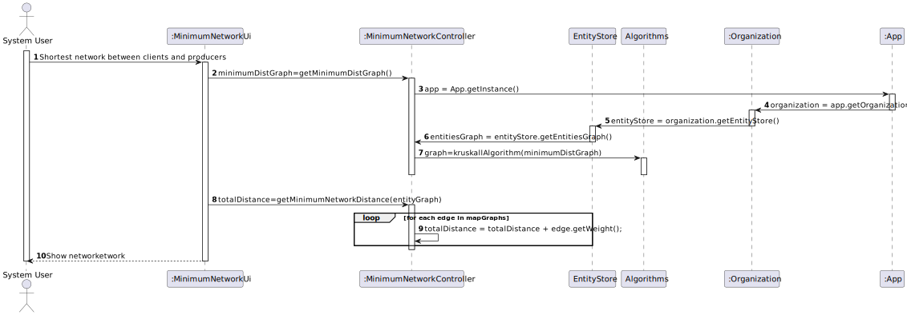
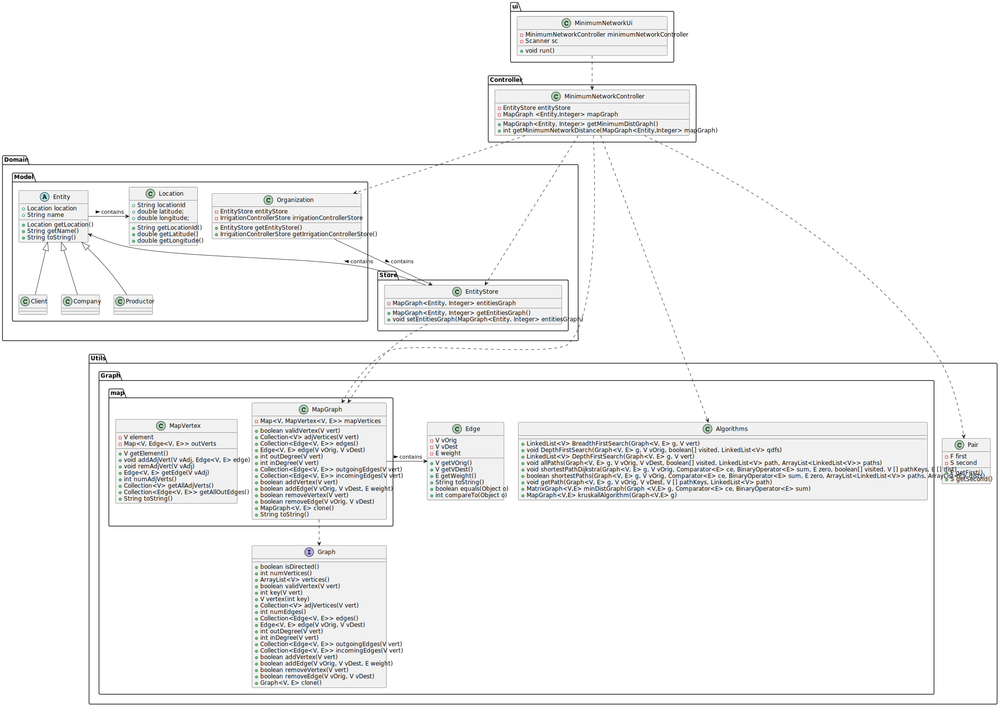

# US 305 - Determine the minimum network

## 1. Requirements Engineering

### 1.1. User Story Description
*Determine the network that connects all customers and agricultural producers with a distance minimum total.*

### 1.2. Acceptance Criteria

* **Acceptance Criteria 1:** Created graph with every client and agricultural producers, with minimum distance.

### 1.3. Found out Dependencies

- *There is a dependency to US301 which is where all the data used in US 305 is imported.*

### 1.4 Input and Output Data

**Input data:**

* Typed data:
    * dont have input data

**Output data:**

* Graph with minimum distance to every client and agriculture production

### 1.5. System Sequence Diagram (SSD)

### 1.6 Other Relevant Remarks

*Dont have relevant remarks*

## 2. OO Analysis

### 2.1. Relevant Domain Model Excerpt

## 3. Design - User Story Realization

### 3.1. Rationale

### Systematization ##

According to the taken rationale, the conceptual classes promoted to software classes are:

* Organization
* Client
* Productor
* Company

Software classes (i.e. Pure Fabrication) identified:

* Entity
* EntityStore
* MinimumNetworkUi
* MinimumNetworkController
* MapGraph
* MapVertex
* Edge
* Algorithms
* Pair

## 3.2. Sequence Diagram (SD)

## 3.3. Class Diagram (CD)

# 4. Tests

**Test 1** Check if the graph returned is correct

	@Test
    void getMinimumDistGraph() {
        App.getInstance().getOrganization().getEntityStore().setEntitiesGraph(new MapGraph<>(false));
        App.getInstance().getOrganization().getEntityStore().getEntitiesGraph().addEdge(client1,comp1,30);
        App.getInstance().getOrganization().getEntityStore().getEntitiesGraph().addEdge(client2,comp1,5);
        App.getInstance().getOrganization().getEntityStore().getEntitiesGraph().addEdge(client3,comp1,25);
        App.getInstance().getOrganization().getEntityStore().getEntitiesGraph().addEdge(client1,comp2,10);
        App.getInstance().getOrganization().getEntityStore().getEntitiesGraph().addEdge(client2,comp2,100);
        App.getInstance().getOrganization().getEntityStore().getEntitiesGraph().addEdge(client3,comp2,35);
        App.getInstance().getOrganization().getEntityStore().getEntitiesGraph().addEdge(comp2,comp1,10);
        MapGraph<Entity,Integer> testgraph=new MapGraph<>(false);
        testgraph.addVertex(client1);
        testgraph.addVertex(comp1);
        testgraph.addVertex(client2);
        testgraph.addVertex(client3);
        testgraph.addVertex(comp2);
        testgraph.addEdge(client1,comp2,10);
        testgraph.addEdge(comp1,client2,5);
        testgraph.addEdge(comp2,comp1,10);
        testgraph.addEdge(client3,comp1,25);
        assertEquals(testgraph,controller.getMinimumDistGraph());
    }

**Test 2** Check if minimumNetworkDistance returned is correct

	 @Test
    void getMinimumNetworkDistance(){
        App.getInstance().getOrganization().getEntityStore().getEntitiesGraph().addEdge(client1,comp1,30);
        App.getInstance().getOrganization().getEntityStore().getEntitiesGraph().addEdge(client2,comp1,5);
        App.getInstance().getOrganization().getEntityStore().getEntitiesGraph().addEdge(client3,comp1,25);
        App.getInstance().getOrganization().getEntityStore().getEntitiesGraph().addEdge(client1,comp2,10);
        App.getInstance().getOrganization().getEntityStore().getEntitiesGraph().addEdge(client2,comp2,100);
        App.getInstance().getOrganization().getEntityStore().getEntitiesGraph().addEdge(client3,comp2,35);
        App.getInstance().getOrganization().getEntityStore().getEntitiesGraph().addEdge(comp2,comp1,10);
        int result=100;
        assertEquals(result,controller.getMinimumNetworkDistance(controller.getMinimumDistGraph()));
    }
# 5. Construction (Implementation)

## class MinimumNetworkController

	public class MinimumNetworkController {
    private EntityStore entityStore;

    private MapGraph<Entity,Integer> mapGraph;

    public MinimumNetworkController(){
        this.entityStore=App.getInstance().getOrganization().getEntityStore();
        this.mapGraph = entityStore.getEntitiesGraph();
    }

    public int getMinimumNetworkDistance(MapGraph<Entity,Integer> mapGraph){
        int totalDistance = 0;
        for (Edge<Entity, Integer> edge : mapGraph.edges()) {
            totalDistance = totalDistance + edge.getWeight();
        }
        return totalDistance;
    }

    /**
     * Method to get the minimum network to connect all entities
     * @return the minimum network graph to connect all entities
     */
    public MapGraph<Entity, Integer> getMinimumDistGraph() {
        MapGraph<Entity, Integer> minimumDistGraph = App.getInstance().getOrganization().getEntityStore().getEntitiesGraph().clone();
        minimumDistGraph = Algorithms.kruskallAlgorithm(minimumDistGraph);
        return minimumDistGraph;
    }

## class MinimumNetworkUI

	public class MinimumNetworkUi implements Runnable{

    MinimumNetworkController minimumNetworkController;

    public MinimumNetworkUi(){
        minimumNetworkController =new MinimumNetworkController();
    }

    Scanner sc = new Scanner(System.in);

    @Override
    public void run() {
        MapGraph<Entity, Integer> entityGraph = minimumNetworkController.getMinimumDistGraph();

        System.out.println("Shortest network between clients and producers: ");

        for (Edge edge : entityGraph.edges()) {
            System.out.println(edge);
            System.out.println("---------------------");
        }

        System.out.println("Number of edges: " + entityGraph.numEdges()/2);
        System.out.println("Total distance: " + minimumNetworkController.getMinimumNetworkDistance(entityGraph)/2);
        System.out.println();

    }

# 6. Integration and Demo

* A new option on the menu options was added.
* Now the user System can see the graph that has all clients and agricultural producers in one Network with a minimum distance

# 7. Observations

* No observations