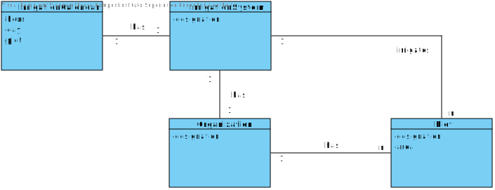
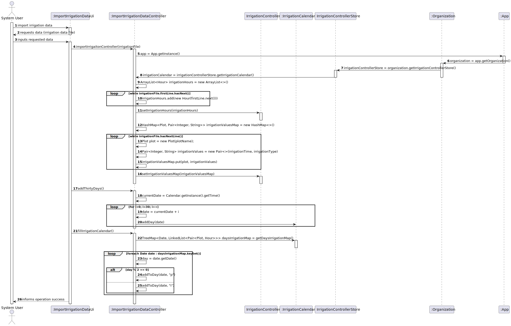
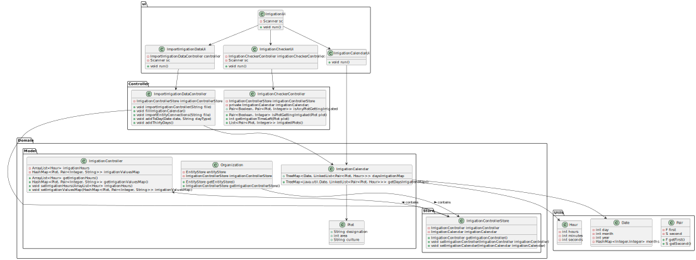

# US 306 - A partir de um ficheiro construir um objecto que simule o funcionamento de um controlador de rega.

## 1. Requirements Engineering

### 1.1. User Story Description
*A partir de um ficheiro construir um objecto que simule o funcionamento de um
controlador de rega.*

### 1.2. Acceptance Criteria

* **Acceptance Criteria 1:** Create irrigation calendar, that shows irrigation plan for the next 30 days
* **Acceptance Criteria 2:** Irrigation Controller must be able to show if a plot is currently being irrigated for any date/hour
### 1.3. Found out Dependencies

- *No dependencies found.*

### 1.4 Input and Output Data

**Input data:**

* Typed data:
    * File path containing the irrigation data to import
    * Date and hour to check if a plot is being irrigated

**Output data:**

* Irrigation Calendar plan
* Boolean value indicating if a plot is being irrigated at a given date/hour and in case of success, the plot and remaining minutes left
* (In)Success of the operation

### 1.5. System Sequence Diagram (SSD)

### 1.6 Other Relevant Remarks

*No relevant remarks*

## 2. OO Analysis

### 2.1. Relevant Domain Model Excerpt

## 3. Design - User Story Realization

### 3.1. Rationale

### Systematization ##

According to the taken rationale, the conceptual classes promoted to software classes are:

* Organization
* Plot
* IrrigationController
* IrrigationCalendar

Software classes (i.e. Pure Fabrication) identified:

* IrrigationCheckerController
* IrrigationCheckerUi
* ImportIrrigationDataController
* ImportIrrigationDataUi
* IrrigationUi
* IrrigationCalendarUi

## 3.2. Import Sequence Diagram (SD)

## 3.3. Class Diagram (CD)

 
# 4. Tests

**Test 1**

	@Test
    void importIrrigationControllerHoursSizeTest() {
        ImportIrrigationDataController controller = new ImportIrrigationDataController();
        String file = "src/test/resources/IrrigationData/irrigation_data_normal";
        try {
            controller.importIrrigationController(file);
        } catch (Exception e) {
            fail("Exception not expected");
        }
        assertEquals(2, irrigationControllerStore.getIrrigationController().getIrrigationHours().size());
    }

**Test 2**

	@Test
    void importIrrigationControllerValuesSizeTest() {
        ImportIrrigationDataController controller = new ImportIrrigationDataController();
        String file = "src/test/resources/IrrigationData/irrigation_data_normal";
        try {
            controller.importIrrigationController(file);
        } catch (Exception e) {
            fail("Exception not expected");
        }
        assertEquals(5, irrigationControllerStore.getIrrigationController().getIrrigationValuesMap().size());
    }

**Test 3:** 

	@Test
    void importIrrigationControllerValuesTest() {
        ImportIrrigationDataController controller = new ImportIrrigationDataController();
        String file = "src/test/resources/IrrigationData/irrigation_data_one_plot";
        try {
            controller.importIrrigationController(file);
        } catch (Exception e) {
            fail("Exception not expected");
        }

        Set<Plot> plots = irrigationControllerStore.getIrrigationController().getIrrigationValuesMap().keySet();
        for (Plot plot : plots) {
            assertEquals(10, irrigationControllerStore.getIrrigationController().getIrrigationValuesMap().get(plot).first());
            assertEquals("t", irrigationControllerStore.getIrrigationController().getIrrigationValuesMap().get(plot).second());
        }

    }

**Test 4:** 

	@Test
    void importIrrigationControllerHoursTest() {
        ImportIrrigationDataController controller = new ImportIrrigationDataController();
        String file = "src/test/resources/IrrigationData/irrigation_data_normal";
        try {
            controller.importIrrigationController(file);
        } catch (Exception e) {
            fail("Exception not expected");
        }

        assertEquals(new Hour(8,30), irrigationControllerStore.getIrrigationController().getIrrigationHours().get(0));
        assertEquals(new Hour(17, 00), irrigationControllerStore.getIrrigationController().getIrrigationHours().get(1));
    }

**Test 5:**

	@Test
    void isPlotGettingIrrigatedNotTest() {
    IrrigationCheckerController controller = new IrrigationCheckerController();
    ImportIrrigationDataController importController = new ImportIrrigationDataController();
        String file = "src/test/resources/IrrigationData/irrigation_data_false_hours";
        try {
            importController.importIrrigationController(file);
        } catch (Exception e) {
            fail("Exception not expected");
        }
        Set<Plot> plots = irrigationControllerStore.getIrrigationController().getIrrigationValuesMap().keySet();
        for (Plot plot : plots) {
            assertFalse(controller.isPlotGettingIrrigated(plot).first());

        }
    }

**Test 6:**

	@Test
    void isPlotGettingIrrigatedYesTest() {
        IrrigationCheckerController controller = new IrrigationCheckerController();
        ImportIrrigationDataController importController = new ImportIrrigationDataController();
        String file = "src/test/resources/IrrigationData/irrigation_data_always_irrigated";
        try {
            importController.importIrrigationController(file);
        } catch (Exception e) {
            fail("Exception not expected");
        }
        Set<Plot> plots = irrigationControllerStore.getIrrigationController().getIrrigationValuesMap().keySet();
        for (Plot plot : plots) {
            assertTrue(controller.isPlotGettingIrrigated(plot).first());
        }
    }

**Test 7:**

	@Test
    void getIrrigationTimeLeft() {
        IrrigationCheckerController controller = new IrrigationCheckerController();
        ImportIrrigationDataController importController = new ImportIrrigationDataController();
        String file = "src/test/resources/IrrigationData/irrigation_data_always_irrigated";
        try {
            importController.importIrrigationController(file);
        } catch (Exception e) {
            fail("Exception not expected");
        }
        Set<Plot> plots = irrigationControllerStore.getIrrigationController().getIrrigationValuesMap().keySet();
        for (Plot plot : plots) {
            boolean timeLeftTrue = controller.getIrrigationTimeLeft(plot) >= 0;
            assertTrue(timeLeftTrue);
        }
    }

**Test 8:**

	@Test
    void irrigatedPlots() {
        IrrigationCheckerController controller = new IrrigationCheckerController();
        ImportIrrigationDataController importController = new ImportIrrigationDataController();
        String file = "src/test/resources/IrrigationData/irrigation_data_always_irrigated";
        try {
            importController.importIrrigationController(file);
        } catch (Exception e) {
            fail("Exception not expected");
        }

        List<Pair<Plot, Integer>> irrigatedPlots = controller.irrigatedPlots();
        assert(irrigatedPlots.size() == 2);
    }
  

# 5. Construction (Implementation)

## class IrrigationCalendar

	public class IrrigationCalendar {

    public TreeMap<Date, LinkedList<Pair<Plot, Hour>>> daysIrrigationMap = new TreeMap<>();

    public IrrigationCalendar() {

    }

    public TreeMap<java.util.Date, LinkedList<Pair<Plot, Hour>>> getDaysIrrigationMap() {
        return daysIrrigationMap;
    }

## class IrrigationCalendarUi

	public class IrrigationCalendarUi implements Runnable {

    @Override
    public void run() {

        IrrigationCalendar irrigationCalendar = App.getInstance().getOrganization().getIrrigationControllerStore().getIrrigationCalendar();
        HashMap<Plot, Pair<Integer, String>> irrigationValuesMap = App.getInstance().getOrganization().getIrrigationControllerStore().getIrrigationController().getIrrigationValuesMap();
        TreeMap<Date, LinkedList<Pair<Plot, Hour>>> daysIrrigationMap = irrigationCalendar.getDaysIrrigationMap();
        for (Date date : daysIrrigationMap.keySet()) {
            System.out.println("Day " + date.getDate() + "/" + (date.getMonth() + 1) + "/" + (date.getYear() + 1900));
            LinkedList<Pair<Plot, Hour>> irrigationList = daysIrrigationMap.get(date);
            for (Pair<Plot, Hour> pair : irrigationList) {
                System.out.println("Plot " + pair.first().  designation + " will get irrigated from " + pair.second().toString() + " to " + pair.second().addMinutes(irrigationValuesMap.get(pair.first()).first()).toString());
            }
            System.out.println();
        }
    }

## class IrrigationCheckerUi

	IrrigationCheckerController irrigationCheckerController;
    public IrrigationCheckerUi(){
        irrigationCheckerController = new IrrigationCheckerController();
    }

    @Override
    public void run() {
        Scanner sc = new Scanner(System.in);
        int option;
        Date date = new Date();
        Hour hour = new Hour();
        System.out.println("Irrigation Checker");
        System.out.println();

        System.out.println("1. Check current date and time");
        System.out.println("2. Specify date and time");
        System.out.println("0. Exit");

            do {
                option = sc.nextInt();
            } while (option < 0 || option > 2);
            switch (option) {
                case 1:
                    date = Date.from(java.time.Instant.now());
                    hour = Hour.currentTime();
                    break;
                case 2:
                    System.out.println("Insert day: ");
                    int day = sc.nextInt();
                    System.out.println("Insert month: ");
                    int month = sc.nextInt();
                    System.out.println("Insert year: ");
                    int year = sc.nextInt();
                    System.out.println("Insert hour: ");
                    int hourValue = sc.nextInt();
                    System.out.println("Insert minutes: ");
                    int minutes = sc.nextInt();
                    date = new Date(year-1900, month-1, day, hourValue, minutes);
                    hour = new Hour(hourValue, minutes);
                    break;

            }
        System.out.println();

        try {
            Pair<Boolean, Pair<Plot, Integer>> irrigatedPlot = irrigationCheckerController.isAnyPlotGettingIrrigated(date, hour);

            if (!irrigatedPlot.first()){
                System.out.println("No plots are being irrigated");
            } else {

                System.out.println("Plot " + irrigatedPlot.second().first().designation + " is currently being irrigated" + " with " + irrigatedPlot.second().second() + " minutes left.");
            }
            System.out.println();

        } finally {
            System.out.println("Irrigation Checker finished");
        }
    }

## class ImportIrrigationDataUi

    ImportIrrigationDataController controller;

    public ImportIrrigationDataUi() {
        controller = new ImportIrrigationDataController();

    }

    Scanner sc = new Scanner(System.in);

    @Override
    public void run() {
        System.out.println("Import Irrigation Controller Data");
        System.out.println("Insert file containing the irrigation controller data to import: "); // file containing irrigation controller data
        String file = sc.nextLine();
        try {
            controller.importIrrigationController(file);
        } catch (FileNotFoundException e) {
            System.out.println("File not found");
        }

        controller.addThirtyDays();
        controller.fillIrrigationCalendar();
        System.out.println("Irrigation Controller imported successfully!");
        System.out.println();

    }

# 6. Integration and Demo

* A new option on the main menu options was added.

# 7. Observations

* No observations were made.

