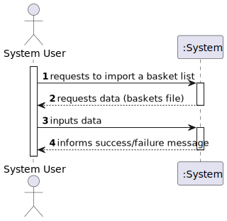
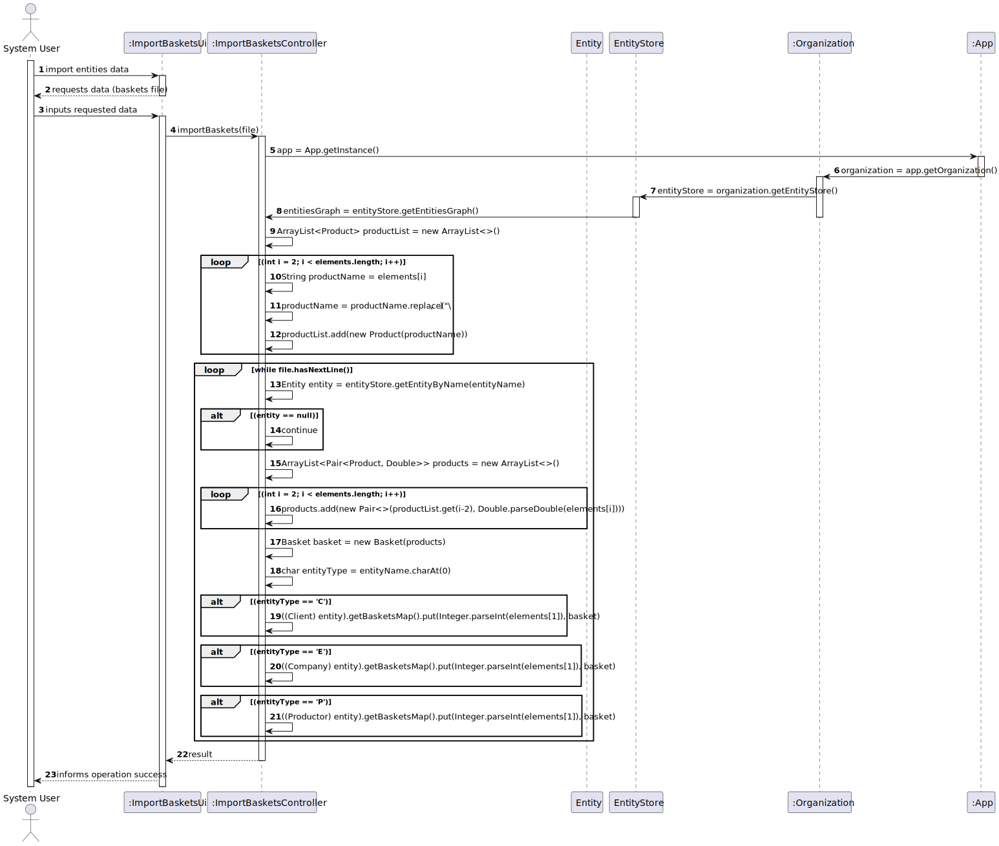

# US 307 - Import a Basket List

## 1. Requirements Engineering

### 1.1. User Story Description
*Construir a rede de distribuição de cabazes a partir da informação fornecida nos ficheiros.

### 1.2. Acceptance Criteria

* **Acceptance Criteria 1:** Import the baskets present in the file correctly.

### 1.3. Found out Dependencies

- *There is a dependency to "US301 Build a distribution network of hampers" since you need entities loaded in the system to associate them with baskets.*

### 1.4 Input and Output Data

**Input data:**

* Typed data:
    * File path containing the baskets to import

**Output data:**

* (In)Success of the operation

### 1.5. System Sequence Diagram (SSD)

### 1.6 Other Relevant Remarks

*The basket will be stored in the Map that is associated with the entity present in the file.*

## 2. OO Analysis

### 2.1. Relevant Domain Model Excerpt

## 3. Design - User Story Realization

### 3.1. Rationale

### Systematization ##

According to the taken rationale, the conceptual classes promoted to software classes are:

* Organization
* Client
* Productor
* Company
* Product
* Basket

Software classes (i.e. Pure Fabrication) identified:

* Entity
* EntityStore
* ImportBasketsController
* ImportBasketsUi
* MapGraph
* MapVertex
* Pair

## 3.2. Sequence Diagram (SD)

## 3.3. Class Diagram (CD)

 
# 4. Tests

**Test 1** Check if Exception is thrown when the file with the baskets is not found

	@Test
    void importBasketsWhenFileIsNotFoundThenThrowException() {
        ImportBasketsController importBasketsController = new ImportBasketsController();
        assertThrows(FileNotFoundException.class, () -> importBasketsController.importBaskets(""));
    }

**Test 2** Check if importBasketsFromFile imports the baskets correctly when the file is found

	@Test
    void importBasketsFromFile() throws FileNotFoundException {
        ImportEntitiesController importEntitiesController=new ImportEntitiesController();
        importEntitiesController.importEntityInfo("src/test/resources/Entities/normal_entities_test.csv");
        ImportBasketsController importBasketsController = new ImportBasketsController();
        importBasketsController.importBaskets("src/test/resources/Cabazes/Teste.csv");
        EntityStore entityStore = App.getInstance().getOrganization().getEntityStore();
        Entity entity = entityStore.getEntityByName("C1");
        TreeMap<Integer, Basket> basketsMap = ((Client) entity).getBasketsMap();
        Basket basket = basketsMap.get(1);
        ArrayList<Pair<Product, Double>> products = basket.getProducts();
        assertEquals(products.size(), 3);
        assertEquals(products.get(0).first().getName(), "Prod1");
        assertEquals(products.get(0).second(), 0);
        assertEquals(products.get(1).first().getName(), "Prod2");
        assertEquals(products.get(1).second(), 0);
        assertEquals(products.get(2).first().getName(),"Prod3");
        assertEquals(products.get(2).second(),0);
    }

# 5. Construction (Implementation)

## class ImportEntitiesController

	public class ImportBasketsController {

    private EntityStore entityStore;
    public ImportBasketsController() {
        this.entityStore = App.getInstance().getOrganization().getEntityStore();
    }

    /**
     * Imports the baskets from a file to entityStore
     * @param file the file to import from
     * @throws FileNotFoundException if the file is not found
     */
    public void importBaskets(String file) throws FileNotFoundException {
        ArrayList<Product> productList = new ArrayList<>(); // list containing all the products
        Scanner sc = new Scanner(new File(file));
        String firstLine = sc.nextLine();
        String[] elements = firstLine.split(",");
        for (int i = 2; i < elements.length; i++) {
            String productName = elements[i];
            productName = productName.replace("\"", "");
            productList.add(new Product(productName));
        }
        int lineNumber = 1;
        while (sc.hasNextLine()) {
            try {
                String line = sc.nextLine();
                elements = line.split(",");
                String entityName = elements[0].replace("\"", "");
                Entity entity = entityStore.getEntityByName(entityName);
                if (entity == null) {
                    continue;
                }
                ArrayList<Pair<Product, Double>> products = new ArrayList<>();
                for (int i = 2; i < elements.length; i++) {
                    products.add(new Pair<>(productList.get(i-2), Double.parseDouble(elements[i])));
                }
                Basket basket = new Basket(products);
                char entityType = entityName.charAt(0); // get the first character of the string to distinguish between the different types of entities
                switch (entityType){
                    case 'C': // if the entity is a client
                        ((Client) entity).getBasketsMap().put(Integer.parseInt(elements[1]), basket);
                        break;
                    case 'E': // if the entity is a company
                        ((Company) entity).getBasketsMap().put(Integer.parseInt(elements[1]), basket);
                        break;
                    case 'P': // if the entity is a productor
                        ((Productor) entity).getBasketsMap().put(Integer.parseInt(elements[1]), basket);
                        break;

                }
            } catch (Exception e) {
                System.out.printf("Error in line: %d %s ", lineNumber, e.getCause());
            }
            lineNumber++;
        }

    }
    }

## class ImportEntitiesUi

	public class ImportBasketsUi implements Runnable {

    ImportBasketsController controller;
    Scanner sc = new Scanner(System.in);
    public ImportBasketsUi() {
        this.controller = new ImportBasketsController();
    }
    @Override
    public void run() {

        System.out.println("Insert file containing the baskets to import: "); // file containing baskets
        String file = sc.nextLine();
        String testFile = "src/main/resources/grafos/Small/cabazes_small.csv";
        String bigFile = "src/main/resources/grafos/Big/cabazes_big.csv";
        try {
            controller.importBaskets(bigFile);
        } catch (FileNotFoundException e) {
            System.out.println("File not found");
        }
    }

    public void print(){

        MapGraph<Entity, Integer> entityGraph = App.getInstance().getOrganization().getEntityStore().getEntitiesGraph();

        for (Entity entity : entityGraph.vertices()) {
            System.out.println(entity.getName());
            TreeMap<Integer, Basket> basketsMap = entity.getBasketsMap();
            for (Integer dayOffset : basketsMap.keySet()) {
                Basket basket = basketsMap.get(dayOffset);
                ArrayList<Pair<Product, Double>> products = basket.getProducts();
                System.out.println("Day " + dayOffset + " basket: ");
                for (Pair<Product, Double> pair : products) {
                    System.out.println(pair.first().getName() + " " + pair.second());
                }
            }
        }
    }
    }

# 6. Integration and Demo

* It is now possible to import baskets into the system from a CSV file.

# 7. Observations

* There are no relevant observations to be made.

