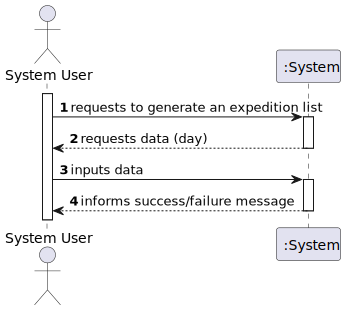
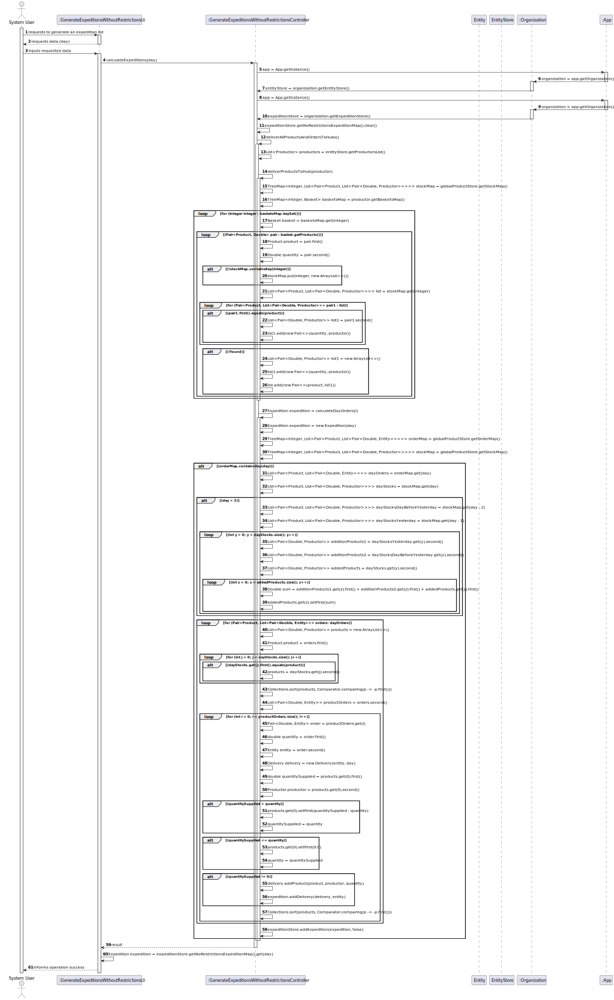

# US 308 - Generate an expedition list for a given day

## 1. Requirements Engineering

### 1.1. User Story Description
**Generate an expedition list for a given day without any restriction related to the producers**

### 1.2. Acceptance Criteria

* **Acceptance Criteria 1:** The expedition list must be correctly generated.

### 1.3. Found out Dependencies

- *There is a dependency to "US301 Build a distribution network of hampers" since you need entities loaded in the system to generate expedition list.*
- *There is a dependency to "US303 Definir os hubs da rede de distribuição" since you need to have hubs of distribution defined in the system in order to generate the expedition list.*
- *There is a dependency to "US307 Import a Basket List" since you need to have baskets imported in order to generate the expedition list*

### 1.4 Input and Output Data

**Input data:**

* Typed data:
    * The day for the expedition list

**Output data:**

* The expedition list
* (In)Success of the operation

### 1.5. System Sequence Diagram (SSD)

### 1.6 Other Relevant Remarks

*The expedition list shows the deliveries per client and the productor that gave them per day .*

## 2. OO Analysis

### 2.1. Relevant Domain Model Excerpt

## 3. Design - User Story Realization

### 3.1. Rationale

### Systematization ##

According to the taken rationale, the conceptual classes promoted to software classes are:

* Organization
* Client
* Productor
* Company
* Product
* Basket
* DayStock
* Delivery
* Expedition

Software classes (i.e. Pure Fabrication) identified:

* Entity
* EntityStore
* ExpeditionStore
* GenerateExpeditionsWithoutRestrictionsController
* GenerateExpeditionsWithoutRestrictionsUi
* MapGraph
* MapVertex
* Pair

## 3.2. Sequence Diagram (SD)

## 3.3. Class Diagram (CD)

 
# 4. Tests

**Test 1** Shows 0 orders in the deliveries when there are no deliveries 

	@Test
    void calculateDayOrdersWhenThereAreNoOrdersThenReturnExpeditionWithNoDeliveries() {
        CalculateExpeditionsNoRestrictionsController calculateExpeditionsNoRestrictionsController = new CalculateExpeditionsNoRestrictionsController();
        calculateExpeditionsNoRestrictionsController.globalProductStore.getOrderMap().clear();
        calculateExpeditionsNoRestrictionsController.globalProductStore.getStockMap().clear();
        int day = 1;
        Expedition expedition = calculateExpeditionsNoRestrictionsController.calculateDayOrders(day);
        assertEquals(0, expedition.getDayDeliveries().size());
    }

**Test 2** Check if deliverProductsToHub works when the product is not in the stock

	@Test
    void deliverProductsToHubWhenProductIsNotInStockMapThenAddProductToStockMap() throws FileNotFoundException {
        ImportEntitiesController importEntitiesController = new ImportEntitiesController();
        importEntitiesController.importEntityInfo("src/test/resources/Entities/normal_entities_test.csv");
        ImportBasketsController importBasketsController = new ImportBasketsController();
        importBasketsController.importBaskets("src/test/resources/Cabazes/Teste.csv");
        CalculateExpeditionsNoRestrictionsController calculateExpeditionsNoRestrictionsController = new CalculateExpeditionsNoRestrictionsController();
        Productor productor = new Productor(new Location("1", 0, 0), "Productor");
        ArrayList<Pair<Product, Double>> products = new ArrayList<>();
        products.add(0, new Pair<>(new Product("Product"), Double.parseDouble("10")));
        Basket basket = new Basket(products);
        TreeMap<Integer, Basket> basketsMap = new TreeMap<>();
        basketsMap.put(1, basket);
        productor.setBasketsMap(basketsMap);
        calculateExpeditionsNoRestrictionsController.deliverProductsToHub(productor);
        assertEquals(1, calculateExpeditionsNoRestrictionsController.globalProductStore.getStockMap().size());
    }

**Test 3** Checks if deliverProductsToHub works when the product is in the stock

    @Test
    void deliverProductsToHubWhenProductIsInStockMapThenAddQuantityAndProductorToListOfProducts() throws FileNotFoundException {
        CalculateExpeditionsNoRestrictionsController controller = new CalculateExpeditionsNoRestrictionsController();
        Productor productor = new Productor(new Location("1", 0, 0), "Productor");
        ArrayList<Pair<Product, Double>> products = new ArrayList<>();
        products.add(0, new Pair<>(new Product("Product"), Double.parseDouble("10")));
        Basket basket = new Basket(products);
        productor.getBasketsMap().put(1, basket);
        controller.deliverProductsToHub(productor);
        assertEquals(10.0, controller.globalProductStore.getStockMap().get(1).get(0).second().get(0).first());
    }

**Test 4** Checks if calculateExpeditions calculates day orders correctly
    
    @Test
    void calculateExpeditionsShouldCalculateDayOrders() {
        CalculateExpeditionsNoRestrictionsController calculateExpeditionsNoRestrictionsController = new CalculateExpeditionsNoRestrictionsController();
        calculateExpeditionsNoRestrictionsController.calculateExpeditions(1);
        assertEquals(1, App.getInstance().getOrganization().getExpeditionStore().getNoRestrictionsExpeditionMap().size());
    }

**Test 5** Checks if the products and orders ar correctly associated with the hubs
    
    @Test
    void calculateExpeditionsShouldDeliverAllProductsAndOrdersToHubs() throws FileNotFoundException {
        ImportEntitiesController importEntitiesController = new ImportEntitiesController();
        importEntitiesController.importEntityInfo("src/test/resources/Entities/normal_entities_test.csv");
        ImportBasketsController importBasketsController = new ImportBasketsController();
        importBasketsController.importBaskets("src/test/resources/Cabazes/Teste.csv");
        CalculateExpeditionsNoRestrictionsController calculateExpeditionsNoRestrictionsController = new CalculateExpeditionsNoRestrictionsController();
        calculateExpeditionsNoRestrictionsController.deliverAllProductsAndOrdersToHubs();
        assertEquals(calculateExpeditionsNoRestrictionsController.globalProductStore.getOrderMap().size(), 2);
        assertEquals(calculateExpeditionsNoRestrictionsController.globalProductStore.getStockMap().size(), 2);
    }

# 5. Construction (Implementation)

## class GenerateExpeditionsWithoutRestrictionsUi

	public class GenerateExpeditionsWithoutRestrictionsUi implements Runnable {

    CalculateExpeditionsController calculateExpeditionsController;

    CalculateExpeditionsNoRestrictionsController calculateExpeditionsNoRestrictionsController;
    Scanner sc = new Scanner(System.in);

    private EntityStore entityStore;
    private ExpeditionStore expeditionStore;

    public GenerateExpeditionsWithoutRestrictionsUi() {
        calculateExpeditionsController = new CalculateExpeditionsController();
        calculateExpeditionsNoRestrictionsController = new CalculateExpeditionsNoRestrictionsController();
        entityStore = App.getInstance().getOrganization().getEntityStore();
        expeditionStore = App.getInstance().getOrganization().getExpeditionStore();

    }

    @Override
    public void run() {
        System.out.println();

        System.out.println("Choose a day to show the expedition list");
        int day = sc.nextInt();
        calculateExpeditionsNoRestrictionsController.calculateExpeditions(day);
        Expedition expedition = expeditionStore.getNoRestrictionsExpeditionMap().get(day);

        if (expedition != null){
            System.out.println("------------------------");
            System.out.println("Day: " + day);
            System.out.println("------------------------");
            List<Pair<Entity, List<Delivery>>> dayDeliveries = expedition.getDayDeliveries();
            System.out.println();
            for (Pair<Entity,List<Delivery>> clientDeliveries : dayDeliveries) {
                System.out.println("Client:" + clientDeliveries.first().getName());
                System.out.println();
                System.out.println("Deliveries:");
                for (Delivery delivery : clientDeliveries.second()) {
                    ArrayList<Pair<Product, Pair<Productor, Double>>> products = delivery.getProductProductorAndQuantityDeliveredList();
                    for (Pair<Product, Pair<Productor, Double>> productProductorAndQuantityDelivered : products) {
                        double askedProduct = 0;
                        ArrayList<Pair<Product, Double>> list = clientDeliveries.first().getBasketsMap().get(day).getProducts();
                        for (Pair<Product, Double> productDoublePair : list) {
                            if (productDoublePair.first().getName().equals(productProductorAndQuantityDelivered.first().getName())) {
                                askedProduct = productDoublePair.second();
                            }
                        }
                        System.out.println("Productor " + productProductorAndQuantityDelivered.second().first() + " delivered product " + productProductorAndQuantityDelivered.first().getName() + " in the quantity of " + productProductorAndQuantityDelivered.second().second() + " of the asked " + askedProduct);
                    }
                }
                System.out.println();
            }

        } else {
            System.out.println("No expeditions for this day");
        }
        }
    }

## class CalculateExpeditionsNoRestrictionsController

	public class CalculateExpeditionsNoRestrictionsController {

    private EntityStore entityStore;
    private ExpeditionStore expeditionStore;

    private FindNearestHubController findNearestHubController = new FindNearestHubController();

    public GlobalProductStore globalProductStore = new GlobalProductStore();

    public CalculateExpeditionsNoRestrictionsController() {
        this.entityStore = App.getInstance().getOrganization().getEntityStore();
        this.expeditionStore = App.getInstance().getOrganization().getExpeditionStore();
        entityStore.setCompanyList();
        entityStore.setProductorsList();

    }

    /**
     * Method that calculates the expeditions for a given dayS
     * @param day day to calculate the expeditions
     */
    public void calculateExpeditions(int day) {
        expeditionStore.getNoRestrictionsExpeditionMap().clear();
        deliverAllProductsAndOrdersToHubs();
        for (int i = 1; i <= day; i++) {
            Expedition expedition = calculateDayOrders(i);
            expeditionStore.addExpedition(expedition, false);
        }

    }

    /**
     * Method that delivers all the products of a productor
     * @param productor productor to deliver the products
     * @return void
     */
    public void deliverProductsToHub(Productor productor) {

        TreeMap<Integer, List<Pair<Product, List<Pair<Double, Productor>>>>> stockMap = globalProductStore.getStockMap();

        TreeMap<Integer, Basket> basketsMap = productor.getBasketsMap();
        for (Integer integer : basketsMap.keySet()) {
            Basket basket = basketsMap.get(integer);
            for (Pair<Product, Double> pair : basket.getProducts()) {
                Product product = pair.first();
                Double quantity = pair.second();
                if (!stockMap.containsKey(integer)) {
                    stockMap.put(integer, new ArrayList<>());
                }
                List<Pair<Product, List<Pair<Double, Productor>>>> list = stockMap.get(integer);
                boolean found = false;
                for (Pair<Product, List<Pair<Double, Productor>>> pair1 : list) {
                    if (pair1.first().equals(product)) {
                        List<Pair<Double, Productor>> list1 = pair1.second();
                        list1.add(new Pair<>(quantity, productor));
                        found = true;
                    }
                }
                if (!found) {
                    List<Pair<Double, Productor>> list1 = new ArrayList<>();
                    list1.add(new Pair<>(quantity, productor));
                    list.add(new Pair<>(product, list1));

                }
            }
        }
    }

    /**
     * Method that generates the order of a client on the nearest hub
     * @return void (updates ordermap of the hub)
     */
    public void generateHubOrder(Entity entity){

        TreeMap<Integer, List<Pair<Product, List<Pair<Double, Entity>>>>> orderMap = globalProductStore.getOrderMap();

        TreeMap<Integer, Basket> basketsMap = entity.getBasketsMap();
        for (Integer integer : basketsMap.keySet()) {
            Basket basket = basketsMap.get(integer);
            for (Pair<Product, Double> pair : basket.getProducts()) {
                Product product = pair.first();
                Double quantity = pair.second();
                if (!orderMap.containsKey(integer)) {
                    orderMap.put(integer, new ArrayList<>());
                }
                List<Pair<Product, List<Pair<Double, Entity>>>> list = orderMap.get(integer);
                boolean found = false;
                for (Pair<Product, List<Pair<Double, Entity>>> pair1 : list) {
                    if (pair1.first().equals(product)) {
                        List<Pair<Double, Entity>> list1 = pair1.second();
                        list1.add(new Pair<>(quantity, entity));
                        found = true;
                    }
                }
                if (!found) {
                    List<Pair<Double, Entity>> list1 = new ArrayList<>();
                    list1.add(new Pair<>(quantity, entity));
                    list.add(new Pair<>(product, list1));

                }
            }
        }
    }

    /**
     * Method that delivers all the products and orders for all days
     * @return void (updates hubs stockmap and ordermap)
     */
    public void deliverAllProductsAndOrdersToHubs(){
        List<Productor> productors = entityStore.getProductorsList();

        for (Productor productor : productors) {
            deliverProductsToHub(productor);;
        }

        for (Entity entity : entityStore.getEntitiesGraph().vertices()){
            if (entity instanceof Company || entity instanceof Client){
                generateHubOrder(entity);
            }
        }

    }

    /**
     * Method that calculates the expeditions for a given day
     * @return Expedition
     */
    public Expedition calculateDayOrders(int day){
        Expedition expedition = new Expedition(day);

        TreeMap<Integer, List<Pair<Product, List<Pair<Double, Entity>>>>> orderMap = globalProductStore.getOrderMap();
        TreeMap<Integer, List<Pair<Product, List<Pair<Double, Productor>>>>> stockMap = globalProductStore.getStockMap();
        if (orderMap.containsKey(day)) {
            List<Pair<Product, List<Pair<Double, Entity>>>> dayOrders = orderMap.get(day);
            List<Pair<Product, List<Pair<Double, Productor>>>> dayStocks = stockMap.get(day);
            if (day > 2){
                List<Pair<Product, List<Pair<Double, Productor>>>> dayStocksDayBeforeYesterday = stockMap.get(day - 2);
                List<Pair<Product, List<Pair<Double, Productor>>>> dayStocksYesterday = stockMap.get(day - 1);
                for (int y = 0; y < dayStocks.size(); y++) {
                    List<Pair<Double, Productor>> additionProducts1 = dayStocksYesterday.get(y).second();
                    List<Pair<Double, Productor>> additionProducts2 = dayStocksDayBeforeYesterday.get(y).second();
                    List<Pair<Double, Productor>> addedProducts = dayStocks.get(y).second();
                    for (int z = 0; z < addedProducts.size(); z++) {
                        Double sum = additionProducts1.get(z).first() + additionProducts2.get(z).first() + addedProducts.get(z).first();
                        addedProducts.get(z).setFirst(sum);
                    }

                }

            }

            for (Pair<Product, List<Pair<Double, Entity>>> orders: dayOrders){
                List<Pair<Double, Productor>> products = new ArrayList<>();
                Product product = orders.first();
                for (int j = 0; j < dayStocks.size(); j++) {
                    if (dayStocks.get(j).first().equals(product)) {
                        products = dayStocks.get(j).second();
                    }
                }
                Collections.sort(products, Comparator.comparing(p -> -p.first()));
                List<Pair<Double, Entity>> productOrders = orders.second();
                for (int i = 0; i < productOrders.size(); i++) {
                    Pair<Double, Entity> order = productOrders.get(i);
                    double quantity = order.first();
                    Entity entity = order.second();
                    Delivery delivery = new Delivery(entity, day);
                    double quantitySupplied = products.get(0).first();

                    Productor productor = products.get(0).second();
                    if (quantitySupplied > quantity) {
                        products.get(0).setFirst(quantitySupplied - quantity);
                        quantitySupplied = quantity;
                    }
                    else if (quantitySupplied <= quantity) {
                        products.get(0).setFirst(0.0);
                        quantity = quantitySupplied;
                    }
                    if (quantitySupplied != 0) {
                        delivery.addProduct(product, productor, quantity);
                        expedition.addDelivery(delivery, entity);
                    }
                    Collections.sort(products, Comparator.comparing(p -> -p.first()));

                }
            }

                } else {
            System.out.println("Invalid Day");
        }
        return expedition;
    }
    }

# 6. Integration and Demo

* It is now possible to generate a expedition list for a given day.

# 7. Observations

* There are no relevant observations to be made.

