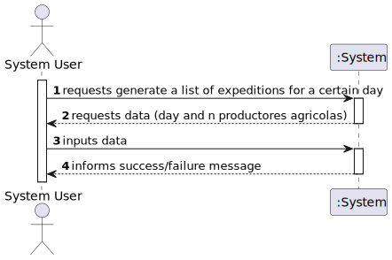
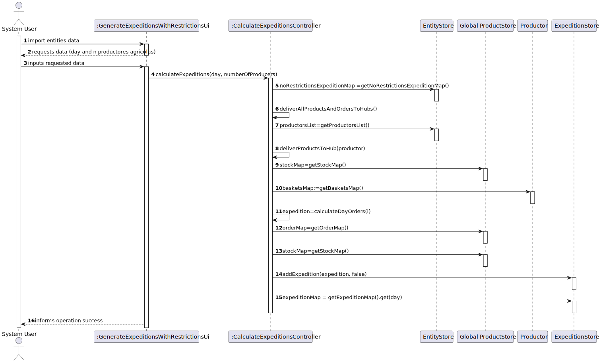

# US 309 - Expedition list for a certain day

## 1. Requirements Engineering

### 1.1. User Story Description
*Gerar uma lista de expedição para um determinado dia que forneça apenas com os N produtores agrícolas mais próximos do hub de entrega do cliente.
### 1.2. Acceptance Criteria

* **Acceptance Criteria 1:** Import the baskets present in the file correctly.

### 1.3. Found out Dependencies

- *Existe uma dependencia na "US309 Import a Basket List" porque e preciso os produtos que cada cliente quer.*
- *Existe uma dependencia na "US301 Construir a rede de distribuição de cabazes a partir da informação fornecida nos ficheiros." porque e preciso as entidades existentes.*

### 1.4 Input and Output Data

**Input data:**

* Typed data:
    * Day
    * Amount of numbers

**Output data:**

* list of expeditions

### 1.5. System Sequence Diagram (SSD)

### 1.6 Other Relevant Remarks

*n/a*

## 2. OO Analysis

### 2.1. Relevant Domain Model Excerpt

## 3. Design - User Story Realization

### 3.1. Rationale

### Systematization ##

According to the taken rationale, the conceptual classes promoted to software classes are:

* Organization
* Client
* Productor
* Company 
* Product
* Basket

Software classes (i.e. Pure Fabrication) identified:

* Entity
* EntityStore
* ImportBasketsController
* ImportBasketsUi
* MapGraph
* MapVertex
* Pair

## 3.2. Sequence Diagram (SD)

## 3.3. Class Diagram (CD)

 
# 4. Tests

**Test 1** calculate for five days 

    @Test
    public void testCalculateExpeditionsFiveDays() {
        int day = 5;
        int numberOfProducers = 2;
        calculateExpeditionsController.calculateExpeditions(day, numberOfProducers);
        assertEquals(5, expeditionStore.getExpeditionMap().size());
    }

**Test 2** calculate for a day

    @Test
    public void testCalculateExpeditionsOneDay() {
    int day = 1;
    int numberOfProducers = 2;
    calculateExpeditionsController.calculateExpeditions(day, numberOfProducers);
    assertEquals(1, expeditionStore.getExpeditionMap().size());
    }

# 5. Construction (Implementation)

## class ImportEntitiesController

	package UI;

    import Controller.App;
    import Controller.CalculateExpeditionsController;
    import Domain.Model.*;
    import Domain.Store.EntityStore;
    import Domain.Store.ExpeditionStore;
    import utils.Pair;
  
    import java.util.*;

    public class GenerateExpeditionsWithRestrictionsUi implements Runnable {

    CalculateExpeditionsController calculateExpeditionsController;

    Scanner sc = new Scanner(System.in);

    private EntityStore entityStore;
    private ExpeditionStore expeditionStore;

    public GenerateExpeditionsWithRestrictionsUi() {
        calculateExpeditionsController = new CalculateExpeditionsController();
        entityStore = App.getInstance().getOrganization().getEntityStore();
        expeditionStore = App.getInstance().getOrganization().getExpeditionStore();

    }

    @Override
    public void run() {
        System.out.println();

        System.out.println("Choose a day to show the expedition list");
        int day = sc.nextInt();
        System.out.println("Choose the amount of producers nearest to the hub to consider");
        int numberOfProducers = sc.nextInt();

        calculateExpeditionsController.calculateExpeditions(day, numberOfProducers);

        Expedition expedition = expeditionStore.getExpeditionMap().get(day);

        if (expedition != null) {
            System.out.println("------------------------");
            System.out.println("Day: " + day);
            System.out.println("------------------------");
            List<Pair<Entity, List<Delivery>>> dayDeliveries = expedition.getDayDeliveries();
            System.out.println();
            for (Pair<Entity,List<Delivery>> clientDeliveries : dayDeliveries) {
                System.out.println("Client:" + clientDeliveries.first().getName());
                System.out.println();
                System.out.println("Deliveries:");
                for (Delivery delivery : clientDeliveries.second()) {
                    ArrayList<Pair<Product, Pair<Productor, Double>>> products = delivery.getProductProductorAndQuantityDeliveredList();
                    for (Pair<Product, Pair<Productor, Double>> productProductorAndQuantityDelivered : products) {
                        double askedProduct = 0;
                        ArrayList<Pair<Product, Double>> list = clientDeliveries.first().getBasketsMap().get(day).getProducts();
                        for (Pair<Product, Double> productDoublePair : list) {
                            if (productDoublePair.first().getName().equals(productProductorAndQuantityDelivered.first().getName())) {
                                askedProduct = productDoublePair.second();
                            }
                        }
                        System.out.println("Productor " + productProductorAndQuantityDelivered.second().first() + " delivered product " + productProductorAndQuantityDelivered.first().getName() + " in the quantity of " + productProductorAndQuantityDelivered.second().second() + " of the asked " + askedProduct);
                    }
                }
                System.out.println();

            }
            int option;
            do {
                System.out.println("Main Menu");
                System.out.println("1. See pickup route");
                System.out.println("0. Exit");
                do {
                    option = sc.nextInt();
                } while (option < 0 || option > 1);
                switch (option) {
                    case 1:
                        new MinimumDistanceRouteUi(expedition).run();
                        break;
                }
            } while (option != 0);

        } else {
            System.out.println("No expeditions for this day");
        }
    }

## class ImportEntitiesUi

	package UI; 
    import Controller.App;
    import Controller.CalculateExpeditionsController;
    import Domain.Model.*;
    import Domain.Store.EntityStore;
    import Domain.Store.ExpeditionStore;
    import utils.Pair;

    import java.util.*;

    public class GenerateExpeditionsWithRestrictionsUi implements Runnable {

    CalculateExpeditionsController calculateExpeditionsController;

    Scanner sc = new Scanner(System.in);

    private EntityStore entityStore;
    private ExpeditionStore expeditionStore;

    public GenerateExpeditionsWithRestrictionsUi() {
        calculateExpeditionsController = new CalculateExpeditionsController();
        entityStore = App.getInstance().getOrganization().getEntityStore();
        expeditionStore = App.getInstance().getOrganization().getExpeditionStore();

    }

    @Override
    public void run() {
        System.out.println();

        System.out.println("Choose a day to show the expedition list");
        int day = sc.nextInt();
        System.out.println("Choose the amount of producers nearest to the hub to consider");
        int numberOfProducers = sc.nextInt();

        calculateExpeditionsController.calculateExpeditions(day, numberOfProducers);

        Expedition expedition = expeditionStore.getExpeditionMap().get(day);

        if (expedition != null) {
            System.out.println("------------------------");
            System.out.println("Day: " + day);
            System.out.println("------------------------");
            List<Pair<Entity, List<Delivery>>> dayDeliveries = expedition.getDayDeliveries();
            System.out.println();
            for (Pair<Entity,List<Delivery>> clientDeliveries : dayDeliveries) {
                System.out.println("Client:" + clientDeliveries.first().getName());
                System.out.println();
                System.out.println("Deliveries:");
                for (Delivery delivery : clientDeliveries.second()) {
                    ArrayList<Pair<Product, Pair<Productor, Double>>> products = delivery.getProductProductorAndQuantityDeliveredList();
                    for (Pair<Product, Pair<Productor, Double>> productProductorAndQuantityDelivered : products) {
                        double askedProduct = 0;
                        ArrayList<Pair<Product, Double>> list = clientDeliveries.first().getBasketsMap().get(day).getProducts();
                        for (Pair<Product, Double> productDoublePair : list) {
                            if (productDoublePair.first().getName().equals(productProductorAndQuantityDelivered.first().getName())) {
                                askedProduct = productDoublePair.second();
                            }
                        }
                        System.out.println("Productor " + productProductorAndQuantityDelivered.second().first() + " delivered product " + productProductorAndQuantityDelivered.first().getName() + " in the quantity of " + productProductorAndQuantityDelivered.second().second() + " of the asked " + askedProduct);
                    }
                }
                System.out.println();

            }
            int option;
            do {
                System.out.println("Main Menu");
                System.out.println("1. See pickup route");
                System.out.println("0. Exit");
                do {
                    option = sc.nextInt();
                } while (option < 0 || option > 1);
                switch (option) {
                    case 1:
                        new MinimumDistanceRouteUi(expedition).run();
                        break;
                }
            } while (option != 0);

        } else {
            System.out.println("No expeditions for this day");
        }
    }

# 6. Integration and Demo

* It is now possible to import baskets into the system from a CSV file.

# 7. Observations

* n/a.

