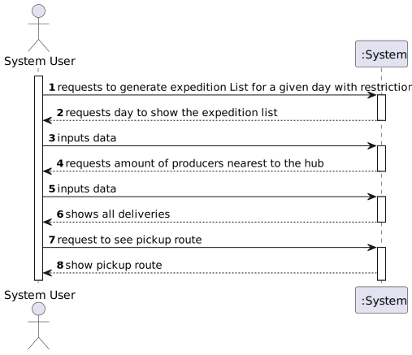

# US 310 - Para uma lista de expedição diária gerar o percurso de entrega que minimiza a distância total percorrida.

## 1. Requirements Engineering

### 1.1. User Story Description
*Construir a rede de distribuição de cabazes a partir da informação fornecida nos ficheiros.

### 1.2. Acceptance Criteria

* **Acceptance Criteria 1:** The expedition list must be correctly generated.

### 1.3. Found out Dependencies

- *There is a dependency to "US301 Build a distribution network of hampers" since you need entities loaded in the system to generate expedition list.*
- *There is a dependency to "US303 Definir os hubs da rede de distribuição" since you need to have hubs of distribution defined in the system in order to generate the expedition list.*
- *There is a dependency to "US307 Import a Basket List" since you need to have baskets imported in order to generate the expedition list

### 1.4 Input and Output Data

**Input data:**

* Typed data:
  * The day for the expedition list
  * The amount of producers nearest to the hub

**Output data:**

* The expedition list
* The pickup route
* (In)Success of the operation

### 1.5. System Sequence Diagram (SSD)

### 1.6 Other Relevant Remarks

*The basket will be stored in the Map that is associated with the entity present in the file.*

## 2. OO Analysis

### 2.1. Relevant Domain Model Excerpt

## 3. Design - User Story Realization

### 3.1. Rationale

### Systematization ##

According to the taken rationale, the conceptual classes promoted to software classes are:

* Organization
* Client
* Productor
* Company
* Product
* Basket
* DayStock
* Delivery
* Expedition

Software classes (i.e. Pure Fabrication) identified:

* Entity
* EntityStore
* ExpeditionStore
* GenerateExpeditionsWithoutRestrictionsController
* GenerateExpeditionsWithoutRestrictionsUi
* MapGraph
* MapVertex
* Pair

## 3.2. Sequence Diagram (SD)

## 3.3. Class Diagram (CD)

 
# 4. Tests

**Test 1** Check if Exception is thrown when the file with the baskets is not found

	@Test
    void importBasketsWhenFileIsNotFoundThenThrowException() {
        ImportBasketsController importBasketsController = new ImportBasketsController();
        assertThrows(FileNotFoundException.class, () -> importBasketsController.importBaskets(""));
    }

**Test 2** Check if importBasketsFromFile imports the baskets correctly when the file is found

	@Test
    void importBasketsFromFile() throws FileNotFoundException {
        ImportEntitiesController importEntitiesController=new ImportEntitiesController();
        importEntitiesController.importEntityInfo("src/test/resources/Entities/normal_entities_test.csv");
        ImportBasketsController importBasketsController = new ImportBasketsController();
        importBasketsController.importBaskets("src/test/resources/Cabazes/Teste.csv");
        EntityStore entityStore = App.getInstance().getOrganization().getEntityStore();
        Entity entity = entityStore.getEntityByName("C1");
        TreeMap<Integer, Basket> basketsMap = ((Client) entity).getBasketsMap();
        Basket basket = basketsMap.get(1);
        ArrayList<Pair<Product, Double>> products = basket.getProducts();
        assertEquals(products.size(), 3);
        assertEquals(products.get(0).first().getName(), "Prod1");
        assertEquals(products.get(0).second(), 0);
        assertEquals(products.get(1).first().getName(), "Prod2");
        assertEquals(products.get(1).second(), 0);
        assertEquals(products.get(2).first().getName(),"Prod3");
        assertEquals(products.get(2).second(),0);
    }

# 5. Construction (Implementation)

## class GenerateExpeditionsWithRestrictionsUi

public class GenerateExpeditionsWithRestrictionsUi implements Runnable {

    CalculateExpeditionsController calculateExpeditionsController;

    Scanner sc = new Scanner(System.in);

    private EntityStore entityStore;
    private ExpeditionStore expeditionStore;

    public GenerateExpeditionsWithRestrictionsUi() {
        calculateExpeditionsController = new CalculateExpeditionsController();
        entityStore = App.getInstance().getOrganization().getEntityStore();
        expeditionStore = App.getInstance().getOrganization().getExpeditionStore();

    }

    @Override
    public void run() {
        System.out.println();

        System.out.println("Choose a day to show the expedition list");
        int day = sc.nextInt();
        System.out.println("Choose the amount of producers nearest to the hub to consider");
        int numberOfProducers = sc.nextInt();

        calculateExpeditionsController.calculateExpeditions(day, numberOfProducers);

        Expedition expedition = expeditionStore.getExpeditionMap().get(day);

        if (expedition != null) {
            System.out.println("------------------------");
            System.out.println("Day: " + day);
            System.out.println("------------------------");
            List<Pair<Entity, List<Delivery>>> dayDeliveries = expedition.getDayDeliveries();
            System.out.println();
            for (Pair<Entity,List<Delivery>> clientDeliveries : dayDeliveries) {
                System.out.println("Client:" + clientDeliveries.first().getName());
                System.out.println();
                System.out.println("Deliveries:");
                for (Delivery delivery : clientDeliveries.second()) {
                    ArrayList<Pair<Product, Pair<Productor, Double>>> products = delivery.getProductProductorAndQuantityDeliveredList();
                    for (Pair<Product, Pair<Productor, Double>> productProductorAndQuantityDelivered : products) {
                        double askedProduct = 0;
                        ArrayList<Pair<Product, Double>> list = clientDeliveries.first().getBasketsMap().get(day).getProducts();
                        for (Pair<Product, Double> productDoublePair : list) {
                            if (productDoublePair.first().getName().equals(productProductorAndQuantityDelivered.first().getName())) {
                                askedProduct = productDoublePair.second();
                            }
                        }
                        System.out.println("Productor " + productProductorAndQuantityDelivered.second().first() + " delivered product " + productProductorAndQuantityDelivered.first().getName() + " in the quantity of " + productProductorAndQuantityDelivered.second().second() + " of the asked " + askedProduct);
                    }
                }
                System.out.println();

            }
            int option;
            do {
                System.out.println("Main Menu");
                System.out.println("1. See pickup route");
                System.out.println("0. Exit");
                do {
                    option = sc.nextInt();
                } while (option < 0 || option > 1);
                switch (option) {
                    case 1:
                        new MinimumDistanceRouteUi(expedition).run();
                        break;
                }
            } while (option != 0);

        } else {
            System.out.println("No expeditions for this day");
        }
    }

## class CalculateExpeditionsController

	public class CalculateExpeditionsController {

    private EntityStore entityStore;
    private ExpeditionStore expeditionStore;

    private FindNearestHubController findNearestHubController = new FindNearestHubController();

    public CalculateExpeditionsController() {
        this.entityStore = App.getInstance().getOrganization().getEntityStore();
        this.expeditionStore = App.getInstance().getOrganization().getExpeditionStore();
        entityStore.setCompanyList();
        entityStore.setProductorsList();
        for (Productor productor : entityStore.getProductorsList()) {
            productor.setOriginalBasketsMap();

        }

    }

    /**
     * Method to calculate the expeditions for a given day
     * @param day day to calculate the expeditions
     * @param numberOfProducers number of producers closests to the hub to consider
     */

    public void calculateExpeditions(int day, int numberOfProducers) {
        expeditionStore.getExpeditionMap().clear();
        deliverAllProductsAndOrdersToHubs(numberOfProducers);
        for (int i = 1; i <= day; i++) {
            Expedition expedition = calculateDayOrders(i);
            expeditionStore.addExpedition(expedition, true);
        }

    }

    /**
     * Method to deliver all the products and generate all the orders for all days
     * @param numberOfProducers number of producers closests to the hub to consider
     */
    public void deliverAllProductsAndOrdersToHubs(int numberOfProducers){
        for (Entity entity : entityStore.getEntitiesGraph().vertices()){
            if (entity instanceof Company || entity instanceof Client){
                generateHubOrder(entity);
            }
        }
        generateHubStocks(numberOfProducers);

    }

    /**
     * Method to deliver the products of a certain productor to a certain hub
     * @param productor  productor to deliver the products
     * @param hub hub to deliver the products
     */
    public void deliverProductsToHub(Productor productor, Company hub) {

        TreeMap<Integer, List<Pair<Product, List<Pair<Double, Productor>>>>> stockMap = hub.getStockMap();
        TreeMap<Integer, List<Pair<Product, Double>>> wantedProductsMap = hub.getWantedProductsMap();
        TreeMap<Integer, Basket> basketsMap = productor.getBasketsMap();
        for (Integer integer : basketsMap.keySet()) {
            Basket basket = basketsMap.get(integer);
            for (Pair<Product, Double> pair : basket.getProducts()) {
                Product product = pair.first();
                Double quantity = pair.second();

                    if (!stockMap.containsKey(integer)) {
                        stockMap.put(integer, new ArrayList<>());
                    }
                    List<Pair<Product, Double>> wantedProducts = wantedProductsMap.get(integer);
                    if (wantedProducts != null) {
                        for (Pair<Product, Double> wantedProduct : wantedProducts) {
                            if (wantedProduct.first().equals(product)) {
                                if (wantedProduct.second() >= quantity) {
                                    wantedProduct.setSecond(wantedProduct.second() - quantity);
                                } else if (wantedProduct.second() == 0) {
                                    quantity = 0.0;
                                } else {
                                    quantity = quantity - wantedProduct.second();
                                    wantedProduct.setSecond(0.0);
                                }
                            }
                        }

                    }

                    List<Pair<Product, List<Pair<Double, Productor>>>> list = stockMap.get(integer);
                    boolean found = false;
                    for (Pair<Product, List<Pair<Double, Productor>>> pair1 : list) {
                        if (pair1.first().equals(product)) {
                            List<Pair<Double, Productor>> list1 = pair1.second();
                            list1.add(new Pair<>(quantity, productor));
                            found = true;
                        }
                    }
                    if (!found) {
                        List<Pair<Double, Productor>> list1 = new ArrayList<>();
                        list1.add(new Pair<>(quantity, productor));
                        list.add(new Pair<>(product, list1));
                    }
                    ArrayList<Pair<Product, Double>> basketList = productor.getBasketsMap().get(integer).getProducts();
                    for (Pair<Product, Double> pair1 : basketList) {
                        if (pair1.first().equals(product)) {
                            pair1.setSecond(pair.second() - quantity);
                        }
                    }
                    HashMap<Company, HashMap<Product, Double>> originalHubStockList = expeditionStore.getOriginalHubStockList();

                    if (!originalHubStockList.containsKey(hub)) {
                        originalHubStockList.put(hub, new HashMap<>());
                    }
                    HashMap<Product, Double> productDoubleHashMap = originalHubStockList.get(hub);
                    if (!productDoubleHashMap.containsKey(product)) {
                        if (quantity != 0) {
                            productDoubleHashMap.put(product, quantity);
                        }
                    } else {
                        if (quantity != 0) {
                            productDoubleHashMap.put(product, productDoubleHashMap.get(product) + quantity);
                        }
                    }

            }
        }
    }

    /**
     * Method to generate the orders for a certain client
     * @param entity client to generate the orders
     */

        public void generateHubOrder(Entity entity){
            Pair<Company, Integer> nearestHub = findNearestHubController.getNearestDistributionHub(entity);

            Company hub = nearestHub.first();
            TreeMap<Integer, List<Pair<Product, List<Pair<Double, Entity>>>>> orderMap = hub.getOrderMap();
            TreeMap<Integer, List<Pair<Product, Double>>> wantedProductsMap = hub.getWantedProductsMap();

            TreeMap<Integer, Basket> basketsMap = entity.getBasketsMap();
            for (Integer integer : basketsMap.keySet()) {
                Basket basket = basketsMap.get(integer);
                for (Pair<Product, Double> pair : basket.getProducts()) {
                    Product product = pair.first();
                    Double quantity = pair.second();
                    if (!orderMap.containsKey(integer)) {
                        orderMap.put(integer, new ArrayList<>());
                    }
                    List<Pair<Product, List<Pair<Double, Entity>>>> list = orderMap.get(integer);
                    boolean found = false;
                    for (Pair<Product, List<Pair<Double, Entity>>> pair1 : list) {
                        if (pair1.first().equals(product)) {
                            List<Pair<Double, Entity>> list1 = pair1.second();
                            list1.add(new Pair<>(quantity, entity));
                            found = true;
                        }
                    }
                    if (!found) {
                        List<Pair<Double, Entity>> list1 = new ArrayList<>();
                        list1.add(new Pair<>(quantity, entity));
                        list.add(new Pair<>(product, list1));

                    }
                    if (!wantedProductsMap.containsKey(integer)) {
                        wantedProductsMap.put(integer, new ArrayList<>());
                    }
                    List<Pair<Product, Double>> list1 = wantedProductsMap.get(integer);
                    boolean found1 = false;
                    for (Pair<Product, Double> pair1 : list1) {
                        if (pair1.first().equals(product)) {
                            pair1.setSecond(pair1.second() + quantity);
                            found1 = true;
                        }
                    }
                    if (!found1) {
                        list1.add(new Pair<>(product, quantity));
                    }

                }
            }
        }

    /**
     * Method to calculate the expedition for a certain day
     * @param day to calculate the expedition
     * @return the expedition for a certain day
     */
        public Expedition calculateDayOrders(int day){
            Expedition expedition = new Expedition(day);
            List<Company> companies = entityStore.getCompanyList();

            for (Company company1 : companies){
                if (company1.isDistributionHub()){
                    TreeMap<Integer, List<Pair<Product, List<Pair<Double, Entity>>>>> orderMap = company1.getOrderMap();
                    TreeMap<Integer, List<Pair<Product, List<Pair<Double, Productor>>>>> stockMap = company1.getStockMap();
                    //System.out.println("Hub: " + company1.getName());
                }
            }

            for (Company company : companies) {
                if (company.isDistributionHub()){
                    TreeMap<Integer, List<Pair<Product, List<Pair<Double, Entity>>>>> orderMap = company.getOrderMap();
                    TreeMap<Integer, List<Pair<Product, List<Pair<Double, Productor>>>>> stockMap = company.getStockMap();
                    if (company.getStockMap().size() != 0){
                        if (orderMap.containsKey(day)) {
                            List<Pair<Product, List<Pair<Double, Entity>>>> dayOrders = orderMap.get(day);
                            List<Pair<Product, List<Pair<Double, Productor>>>> dayStocks = stockMap.get(day);
                            // add stock of previous 2 days
                            if (day > 2){
                                List<Pair<Product, List<Pair<Double, Productor>>>> dayStocksDayBeforeYesterday = stockMap.get(day - 2);
                                List<Pair<Product, List<Pair<Double, Productor>>>> dayStocksYesterday = stockMap.get(day - 1);
                                for (int y = 0; y < dayStocks.size(); y++) {
                                    List<Pair<Double, Productor>> additionProducts1 = dayStocksYesterday.get(y).second();
                                    List<Pair<Double, Productor>> additionProducts2 = dayStocksDayBeforeYesterday.get(y).second();
                                    List<Pair<Double, Productor>> addedProducts = dayStocks.get(y).second();
                                    for (int z = 0; z < addedProducts.size(); z++) {
                                        Double sum = additionProducts1.get(z).first() + additionProducts2.get(z).first() + addedProducts.get(z).first();
                                        addedProducts.get(z).setFirst(sum);
                                    }
                                }
                            }

                            for (Pair<Product, List<Pair<Double, Entity>>> orders: dayOrders){
                                List<Pair<Double, Productor>> products = new ArrayList<>();
                                Product product = orders.first();
                                for (int j = 0; j < dayStocks.size(); j++) {
                                    if (dayStocks.get(j).first().equals(product)) {
                                        products = dayStocks.get(j).second();
                                    }
                                }
                                Collections.sort(products, Comparator.comparing(p -> -p.first()));
                                List<Pair<Double, Entity>> productOrders = orders.second();
                                for (int i = 0; i < productOrders.size(); i++) {
                                    Pair<Double, Entity> order = productOrders.get(i);
                                    double quantity = order.first();
                                    Entity entity = order.second();
                                    Delivery delivery = new Delivery(entity, day);
                                    double quantitySupplied = products.get(0).first();

                                    Productor productor = products.get(0).second();
                                    if (quantitySupplied > quantity) {
                                        products.get(0).setFirst(quantitySupplied - quantity);
                                        quantitySupplied = quantity;
                                    }
                                    else if (quantitySupplied <= quantity) {
                                        products.get(0).setFirst(0.0);
                                        quantity = quantitySupplied;
                                    }
                                    if (quantitySupplied != 0) {
                                        delivery.addProduct(product, productor, quantity);
                                        expedition.addDelivery(delivery, entity);
                                    }
                                    Collections.sort(products, Comparator.comparing(p -> -p.first()));

                                }
                            }
                        }
                    }

                }
            }
            return expedition;
        }

    /**
     * Method to generate all the hub stocks
     * @param numberOfProducers the number of producers close to the hub to consider
     */
    public void generateHubStocks(int numberOfProducers){
        List<Company> companies = entityStore.getCompanyList();
        for (Company company : companies) {
            if (company.isDistributionHub()){
                List<Pair<Productor, Integer>> producers = getProducers(company, numberOfProducers);
                for (Pair<Productor,Integer> productor : producers) {
                        deliverProductsToHub(productor.first(), company);
                    }

                }

            }
        }

    /**
     * Method to get the reachable producers to a hub
     * @param entity the hub
     * @return the reachable producers to a hub with their respective distances
     */
    public List<Pair<Productor, Integer>> getHubReachableProducers(Entity entity) {
        List<Pair<Productor, Integer>> reachableProducers = new ArrayList<>();
        MapGraph<Entity, Integer> entityGraph = entityStore.getEntitiesGraph();
        ArrayList<LinkedList<Entity>> paths = new ArrayList<>();
        ArrayList<Integer> pathsDistances = new ArrayList<>();

        Algorithms.shortestPaths(entityGraph, entity, Integer::compareTo, Integer::sum,0, paths, pathsDistances);
        for (int i = 0; i < paths.size(); i++) {
            if (paths.get(i).getLast() instanceof Productor) {
                reachableProducers.add(new Pair<>((Productor) paths.get(i).getLast(), pathsDistances.get(i)));
            }
        }

        return reachableProducers;
    }

    /**
     * Method to get the closest producers to a hub
     * @param entity the hub
     * @param numberOfProducers the number of producers to consider
     * @return the closest producers to a hub with their respective distances
     */
    public List<Pair<Productor, Integer>> getProducers(Entity entity, int numberOfProducers) {
        List<Pair<Productor, Integer>> reachableProducers = getHubReachableProducers(entity);
        Collections.sort(reachableProducers, Comparator.comparing(p -> p.second()));

        List<Pair<Productor, Integer>> producers = new ArrayList<>();
        for (int i = 0; i < numberOfProducers; i++) {
            producers.add(new Pair<>(reachableProducers.get(i).first(), reachableProducers.get(i).second()));
        }

        return producers;
    }

}

# 6. Integration and Demo

* It is now possible to generate a expedition list for a given day.

# 7. Observations

* There are no relevant observations to be made.

