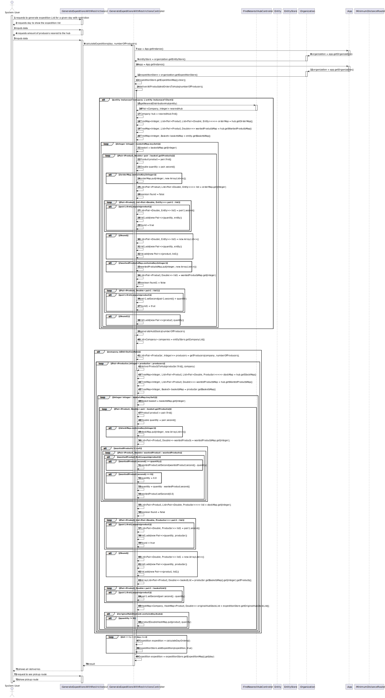

# US 311 - For an expedition list, generate statistics

## 1. Requirements Engineering

### 1.1. User Story Description
*US311 - Para uma lista de expedição calcular estatísticas:
• por cabaz: nº de produtos totalmente satisfeitos, nº de produtos parcialmente satisfeitos, nº
de produtos não satisfeitos, percentagem total do cabaz satisfeito, nº de produtores que
forneceram o cabaz.
• por cliente: nº de cabazes totalmente satisfeitos, nº de cabazes parcialmente satisfeitos, nº
de fornecedores distintos que forneceram todos os seus cabazes
• por produtor: nº de cabazes fornecidos totalmente, nº de cabazes fornecidos parcialmente,
nº de clientes distintos fornecidos, nº de produtos totalmente esgotados, nº de hubs
fornecidos.
• por hub: nº de clientes distintos que recolhem cabazes em cada hub, nº de produtores
distintos que fornecem cabazes para o hub.*

### 1.2. Acceptance Criteria

* **Acceptance Criteria 1:** The statistic are generated correctly.

### 1.3. Found out Dependencies

- *There is a dependency to "US301 Build a distribution network of hampers" since you need entities loaded in the system to generate statistics.*
- *There is a dependency to "US303 Definir os hubs da rede de distribuição" since you need to have hubs of distribution defined in the system in order to generate statistics.*
- *There is a dependency to "US307 Import a Basket List" since you need to have baskets imported in order to generate statistics*
- *There is a dependency to "US308 Generate an expedition list for a given day or 309 Expedition list for a certain day" since you need to have an expedition list generated in order to obtain its statistics. 

### 1.4 Input and Output Data

**Input data:**

* Typed data:
  * Day
  * Amount of numbers

**Output data:**

* Expedition list Statistics
* (In)Success of the operation

### 1.5. System Sequence Diagram (SSD)

### 1.6 Other Relevant Remarks

*n/A*

## 2. OO Analysis

### 2.1. Relevant Domain Model Excerpt

## 3. Design - User Story Realization

### 3.1. Rationale

### Systematization ##

According to the taken rationale, the conceptual classes promoted to software classes are:

* Organization
* Client
* Productor
* Company
* Product
* Basket
* Productor

Software classes (i.e. Pure Fabrication) identified:

* Entity
* EntityStore
* ExpeditionStatsController
* ExpeditionStatsUi
* MapGraph
* MapVertex
* Pair

## 3.2. Sequence Diagram (SD)

## 3.3. Class Diagram (CD)

 
# 4. Tests

**Test 1** Check if the number of producers that deliver baskets to this hub is correct

	 @Test
    @DisplayName("Should print the correct amount of producers that deliver baskets to this hub")
    void hubStatsShouldPrintCorrectAmountOfProducersThatDeliverBasketsToThisHub() {
        Location location = new Location("1",0, 0);
        Product product = new Product("product");
        Product product1 = new Product("product1");
        Product product2 = new Product("product2");
        Product product3 = new Product("product3");
        Product product4 = new Product("product4");
        Product product5 = new Product("product5");
        Product product6 = new Product("product6");
        Product product7 = new Product("product7");
        Product product8 = new Product("product8");

        Company company = new Company(location, "company");
        Company company1 = new Company(location, "company1");
        Company company2 = new Company(location, "company2");

        company.setDistributionHub(true);
        company1.setDistributionHub(true);
        company2.setDistributionHub(true);

        Basket basket = new Basket(new ArrayList<>());
        Basket basket1 = new Basket(new ArrayList<>());
        Basket basket2 = new Basket(new ArrayList<>());

        basket.addQuantity(product, Double.parseDouble("10"));
        basket.addQuantity(product1, Double.parseDouble("10"));
        basket.addQuantity(product2, Double.parseDouble("10"));

        basket1.addQuantity(product3, Double.parseDouble("10"));
        basket1.addQuantity(product4, Double.parseDouble("10"));
        basket1.addQuantity(product5, Double.parseDouble("10"));

        basket2.addQuantity(product6, Double.parseDouble("10"));
        basket2.addQuantity(product7, Double.parseDouble("10"));
        basket2.addQuantity(product8, Double.parseDouble("10"));

        TreeMap<Integer, Basket> basketsMap = new TreeMap<>();

        basketsMap.put(0, basket);
        basketsMap.put(1, basket1);
        basketsMap.put(2, basket2);

        company.setBasketsMap(basketsMap);

        List<Pair<Double, Entity>> list = new ArrayList<>();

        list.add(new Pair<>(10d, company));

        List<Pair<Double, Entity>> list1 = new ArrayList<>();

        list1.add(new Pair<>(10d, company));

        List<Pair<Double, Entity>> list2 = new ArrayList<>();

        list2.add(new Pair<>(10d, company));

        List<Pair<Double, Entity>> list3 = new ArrayList<>();

        list3.add(new Pair<>(10d, company));

        List<Pair<Double, Entity>> list4 = new ArrayList<>();

        list4.add(new Pair<>(10d, company));

        List<Pair<Double, Entity>> list5 = new ArrayList<>();

        list5.add(new Pair<>(10d, company));

        List<Pair<Double, Entity>> list6 = new ArrayList<>();

        list6.add(new Pair<>(10d, company));

        List<Pair<Double, Entity>> list7 = new ArrayList<>();

        list7.add(new Pair<>(10d, company));

        List<Pair<Double, Entity>> list8 = new ArrayList<>();

        list8.add(new Pair<>(10d, company));

        List<Pair<Double, Entity>> list9 = new ArrayList<>();

        list9.add(new Pair<>(10d, company));
    }

**Test 2** Check if the percentage of satisfied products is correct

	@Test
    @DisplayName("Should print the correct percentage of satisfied products")
    void basketDayStatsShouldPrintCorrectPercentageOfSatisfiedProducts() {
        ExpeditionStatsController expeditionStatsController = new ExpeditionStatsController();
        Product product1 = new Product("product1");
        Product product2 = new Product("product2");
        Product product3 = new Product("product3");
        Product product4 = new Product("product4");
        Product product5 = new Product("product5");
        Product product6 = new Product("product6");
        Product product7 = new Product("product7");
        Product product8 = new Product("product8");
        Product product9 = new Product("product9");
        Product product10 = new Product("product10");

        Location location1 = new Location("1",0, 0);
        Location location2 = new Location("1",0, 0);
        Location location3 = new Location("3",0, 0);

        Company company1 = new Company(location1, "company1");
        Company company2 = new Company(location2, "company2");
        Company company3 = new Company(location3, "company3");

        company1.setDistributionHub(true);
        company2.setDistributionHub(true);

        List<Product> products1 = new ArrayList<>();
        products1.add(product1);
        products1.add(product2);
        products1.add(product3);

        List<Product> products2 = new ArrayList<>();
        products2.add(product4);
        products2.add(product5);

        List<Product> products3 = new ArrayList<>();
        products3.add(product6);

        List<Product> products4 = new ArrayList<>();
        products4.add(product7);

        List<Product> products5 = new ArrayList<>();
        products5.add(product8);

        List<Product> products6 = new ArrayList<>();
        products6.add(product9);

        List<Product> products7 = new ArrayList<>();
        products7.add(product10);
    }

# 5. Construction (Implementation)

## class ExpeditionStatsController

	public class ExpeditionStatsController {

    private EntityStore entityStore;
    private ExpeditionStore expeditionStore;

    public ExpeditionStatsController() {
        this.entityStore = App.getInstance().getOrganization().getEntityStore();
        this.expeditionStore = App.getInstance().getOrganization().getExpeditionStore();
        entityStore.setProductorsList();
        entityStore.setCompanyList();
    }

    /**
     * prints stats for baskets for a given day
     * @return void
     * @param expedition
     * @param day
     */
    public void basketDayStats(Expedition expedition, int day) {

        List<Pair<Entity, List<Delivery>>> dayDeliveries = expedition.getDayDeliveries();
        System.out.println();
        for (Pair<Entity,List<Delivery>> clientDeliveries : dayDeliveries) {
            double totalProducts = 0;
            double totalProductsSupplied = 0;
            int satisfiedProducts = 0;
            int partiallySatisfiedProducts = 0;
            int unsatisfiedProducts = 0;
            double percentageSatisfiedProducts = 0;
            List<Productor> productors = new ArrayList<>();
            System.out.println("Client:" + clientDeliveries.first().getName());
            System.out.println();
            for (Delivery delivery : clientDeliveries.second()) {
                ArrayList<Pair<Product, Pair<Productor, Double>>> products = delivery.getProductProductorAndQuantityDeliveredList();
                for (Pair<Product, Pair<Productor, Double>> productProductorAndQuantityDelivered : products) {
                    double askedProduct = 0;
                    ArrayList<Pair<Product, Double>> list = clientDeliveries.first().getBasketsMap().get(day).getProducts();
                    for (Pair<Product, Double> productDoublePair : list) {
                        if (productDoublePair.first().getName().equals(productProductorAndQuantityDelivered.first().getName())) {
                            askedProduct = productDoublePair.second();

                        }
                    }

                    if (askedProduct == productProductorAndQuantityDelivered.second().second()) {
                        satisfiedProducts++;
                    } else  {
                        partiallySatisfiedProducts++;
                    }

                    if (!productors.contains(productProductorAndQuantityDelivered.second().first())) {
                        productors.add(productProductorAndQuantityDelivered.second().first());
                    }
                    totalProductsSupplied = totalProductsSupplied + productProductorAndQuantityDelivered.second().second();
                    //System.out.println("Productor " + productProductorAndQuantityDelivered.second().first() + " delivered product " + productProductorAndQuantityDelivered.first().getName() + " in the quantity of " + productProductorAndQuantityDelivered.second().second() + " of the asked " + askedProduct);
                }

            }
            ArrayList<Pair<Product, Double>> list1 = clientDeliveries.first().getBasketsMap().get(day).getProducts();
            for (Pair<Product, Double> productDoublePair : list1) {
                totalProducts = totalProducts + productDoublePair.second();
                if (productDoublePair.second() == 0) {
                    satisfiedProducts++;
                }
            }
            unsatisfiedProducts = list1.size() - (satisfiedProducts + partiallySatisfiedProducts);
            percentageSatisfiedProducts = totalProductsSupplied / totalProducts * 100;
            percentageSatisfiedProducts = (double)Math.round(percentageSatisfiedProducts * 100d) / 100d; // round
            System.out.println("Amount of producers that contributed to this basket: " + productors.size());
            System.out.println("Amount of satisfied products: " + satisfiedProducts);
            System.out.println("Amount of partially satisfied products: " + partiallySatisfiedProducts);
            System.out.println("Amount of unsatisfied products: " + unsatisfiedProducts);
            System.out.println("Percentage of satisfied products: " + percentageSatisfiedProducts + "% (" + totalProductsSupplied + "/" + totalProducts + ")");
            System.out.println();
            System.out.println();

            productors.clear();
            System.out.println();

        }
    }

    /**
     * prints stats for every client for all days
     * @return void
     * @param expeditions Tree map of all the expeditions
     */
    public void clientStats(TreeMap<Integer, Expedition> expeditions) {
        HashMap<Entity, Pair<Pair<Integer, Integer>, List<Productor>>> clients = new HashMap<>(); // cliente, cabazes satisfeitos, cabazes parciais, lista de fornecedores
        for (Expedition expedition : expeditions.values()) {
            List<Pair<Entity, List<Delivery>>> dayDeliveries = expedition.getDayDeliveries();
            //System.out.println();
            for (Pair<Entity,List<Delivery>> clientDeliveries : dayDeliveries) {
                if (!clients.containsKey(clientDeliveries.first())) {
                    clients.put(clientDeliveries.first(), new Pair<>(new Pair<>(0,0), new ArrayList<>()));
                }
                double totalProducts = 0;
                double totalProductsSupplied = 0;
                int satisfiedProducts = 0;
                int partiallySatisfiedProducts = 0;
                int unsatisfiedProducts = 0;
                double percentageSatisfiedProducts = 0;
                List<Productor> productors = new ArrayList<>();
                //System.out.println("Client:" + clientDeliveries.first().getName());
                //System.out.println();
                for (Delivery delivery : clientDeliveries.second()) {
                    ArrayList<Pair<Product, Pair<Productor, Double>>> products = delivery.getProductProductorAndQuantityDeliveredList();
                    for (Pair<Product, Pair<Productor, Double>> productProductorAndQuantityDelivered : products) {
                        double askedProduct = 0;
                        ArrayList<Pair<Product, Double>> list = clientDeliveries.first().getBasketsMap().get(expedition.getDayOffset()).getProducts();
                        for (Pair<Product, Double> productDoublePair : list) {
                            if (productDoublePair.first().getName().equals(productProductorAndQuantityDelivered.first().getName())) {
                                askedProduct = productDoublePair.second();
                            }
                        }

                        if (askedProduct == productProductorAndQuantityDelivered.second().second()) {
                            satisfiedProducts++;
                        } else  {
                            partiallySatisfiedProducts++;
                        }

                        if (!clients.get(clientDeliveries.first()).second().contains(productProductorAndQuantityDelivered.second().first())) {
                            clients.get(clientDeliveries.first()).second().add(productProductorAndQuantityDelivered.second().first());
                        }
                        totalProductsSupplied = totalProductsSupplied + productProductorAndQuantityDelivered.second().second();
                        //System.out.println("Productor " + productProductorAndQuantityDelivered.second().first() + " delivered product " + productProductorAndQuantityDelivered.first().getName() + " in the quantity of " + productProductorAndQuantityDelivered.second().second() + " of the asked " + askedProduct);
                    }

                }
                ArrayList<Pair<Product, Double>> list1 = clientDeliveries.first().getBasketsMap().get(expedition.getDayOffset()).getProducts();
                for (Pair<Product, Double> productDoublePair : list1) {
                    totalProducts = totalProducts + productDoublePair.second();
                    if (productDoublePair.second() == 0) {
                        satisfiedProducts++;
                    }
                }
                unsatisfiedProducts = list1.size() - (satisfiedProducts + partiallySatisfiedProducts);
                percentageSatisfiedProducts = totalProductsSupplied / totalProducts * 100;

                if (percentageSatisfiedProducts == 100) {
                    clients.get(clientDeliveries.first()).first().setFirst(clients.get(clientDeliveries.first()).first().first() + 1);
                } else if (percentageSatisfiedProducts > 0) {
                    clients.get(clientDeliveries.first()).first().setSecond(clients.get(clientDeliveries.first()).first().second() + 1);
                }

                productors.clear();

            }
        }
        for (Entity client : clients.keySet()) {
            System.out.println("Client: " + client.getName());
            System.out.println("Amount of satisfied baskets: " + clients.get(client).first().first());
            System.out.println("Amount of partially satisfied baskets: " + clients.get(client).first().second());
            System.out.println("Amount of producers that contributed to this client: " + clients.get(client).second().size());
            System.out.println();
        }
    }

    /**
     * prints stats for every productor for all days
     * @return void
     * @param expeditions Tree map of all the expeditions
     */
    public void productorStats(TreeMap<Integer, Expedition> expeditions) {

        List<Productor> productorList = entityStore.getProductorsList();
        List<Company> companyList = entityStore.getCompanyList();
        List<Pair<Company, List<Productor>>> companyProductorList = new ArrayList<>();

        for (Company company : companyList) {
            if (company.isDistributionHub()) {
                List<Productor> distinctProductors = new ArrayList<>();
                TreeMap<Integer, List<Pair<Product, List<Pair<Double, Productor>>>>> stockMap = company.getStockMap();
                for (Integer day : stockMap.keySet()) {
                    List<Pair<Product, List<Pair<Double, Productor>>>> stocks = stockMap.get(day);
                    for (Pair<Product, List<Pair<Double, Productor>>> stock : stocks) {
                        for (Pair<Double, Productor> productorDoublePair : stock.second()) {
                            if (!distinctProductors.contains(productorDoublePair.second()) && productorDoublePair.first() != 0) {
                                distinctProductors.add(productorDoublePair.second());
                            }
                        }
                    }

                }
                companyProductorList.add(new Pair<>(company, distinctProductors));
            }
        }

        for (Productor productor : productorList){
            int suppliedHubs = 0;
            for (Pair<Company, List<Productor>> companyListPair : companyProductorList) {
                if (companyListPair.second().contains(productor)) {
                    suppliedHubs++;
                }
            }
            int totallyDelivered = 0;
            int partiallyDelivered = 0;
            int soldOutProducts = 0;
            TreeMap<Integer, Basket> originalBasketsMap = productor.getOriginalBasketsMap();
            TreeMap<Integer, Basket> basketsMap = productor.getBasketsMap();
            for (Integer day : basketsMap.keySet()) {
                boolean totallyDeliveredBool = true;
                boolean partiallyDeliveredBool = false;
                Basket basket = basketsMap.get(day);
                Basket originalBasket = originalBasketsMap.get(day);
                List<Pair<Product, Double>> products = basket.getProducts();
                List<Pair<Product, Double>> originalProducts = originalBasket.getProducts();
                for (int i = 0; i < products.size(); i++) {
                    if (products.get(i).second() != 0){
                        products.get(i).first().setSoldOut(false);
                        totallyDeliveredBool = false;
                    }
                    if (products.get(i).second() != originalProducts.get(i).second()) {
                        partiallyDeliveredBool = true;
                    }
                }
                if (totallyDeliveredBool) {
                    totallyDelivered++;
                } else if (partiallyDeliveredBool) {
                    partiallyDelivered++;
                }
            }

            TreeMap<Integer, Basket> basketsMap1 = productor.getBasketsMap();
            Basket basket = basketsMap1.get(1);
            List<Pair<Product, Double>> products = basket.getProducts();
            for (Pair<Product, Double> productDoublePair : products) {
                if (productDoublePair.first().isSoldOut()) {
                    soldOutProducts++;
                }
                productDoublePair.first().setSoldOut(true);
            }
            System.out.println("Productor: " + productor.getName());
            System.out.println("Amount of totally delivered baskets: " + totallyDelivered);
            System.out.println("Amount of partially delivered baskets: " + partiallyDelivered);
            System.out.println("Amount of sold out products: " + soldOutProducts);
            System.out.println("Amount of hubs that received products from this productor: " + suppliedHubs);
            System.out.println();

        }

    }

    /**
     * prints stats for every company for all days
     * @return void
     * @param expeditions Tree map of all the expeditions
     */
    public void hubStats(TreeMap<Integer, Expedition> expeditions) {
        List<Company> companyList = entityStore.getCompanyList();

        for (Company company : companyList) {
            if (company.isDistributionHub()){
                List<Productor> distinctProductors = new ArrayList<>();
                TreeMap<Integer, List<Pair<Product, List<Pair<Double, Entity>>>>> orderMap = company.getOrderMap();
                TreeMap<Integer, List<Pair<Product, List<Pair<Double, Productor>>>>> stockMap = company.getStockMap();

                for (Integer day : orderMap.keySet()) {
                    List<Pair<Product, List<Pair<Double, Productor>>>> stocks = stockMap.get(day);
                    for (Pair<Product, List<Pair<Double, Productor>>> stock : stocks) {
                        for (Pair<Double, Productor> productorDoublePair : stock.second()) {
                            if (!distinctProductors.contains(productorDoublePair.second()) && productorDoublePair.first() != 0) {
                                distinctProductors.add(productorDoublePair.second());
                            }
                        }
                    }

                }

                System.out.println("Hub: " + company.getName());
                if (orderMap.size() == 0) {
                    System.out.println("Zero clients pickup orders at this hub");
                } else System.out.println("Amount of clients that pickup baskets at this hub: " + orderMap.get(1).get(0).second().size());

                if (distinctProductors.size() != 0){
                    System.out.println("Amount of producers that deliver baskets to this hub: " + distinctProductors.size());
                } else {
                    System.out.println("Zero producers deliver baskets to this hub");
                }

                System.out.println();
                System.out.println();
            }

        }
    }
    }

## class ExpeditionStatsUi

	public class ExpeditionStatsUi implements Runnable {

    Expedition expedition;
    ExpeditionStore expeditionStore;

    ExpeditionStatsController expeditionStatsController;
    CalculateExpeditionsController calculateExpeditionsController;

    EntityStore entityStore;

    Scanner sc = new Scanner(System.in);

    public ExpeditionStatsUi() {
        expeditionStatsController = new ExpeditionStatsController();
        calculateExpeditionsController = new CalculateExpeditionsController();
        this.expeditionStore = App.getInstance().getOrganization().getExpeditionStore();
        this.entityStore = App.getInstance().getOrganization().getEntityStore();

    }

    @Override
    public void run() {
        expeditionStore.getExpeditionMap().clear();

        MapGraph<Entity, Integer> graph = entityStore.getEntitiesGraph();
        int dayLimit = graph.vertices().get(0).getBasketsMap().size();
        System.out.println("Expedition Stats");
        System.out.println();
        System.out.println("Choose the amount of producers nearest to the hub to consider");
        int numberOfHubs = sc.nextInt();
        calculateExpeditionsController.calculateExpeditions(dayLimit + 1, numberOfHubs);

        TreeMap<Integer, Expedition> expeditionMap = expeditionStore.getExpeditionMap();

        int option;
        do {
            System.out.println("1. View basket stats");
            System.out.println("2. View client stats");
            System.out.println("3. View producer stats");
            System.out.println("4. View hub stats");
            System.out.println("0. Exit");
            do {
                option = sc.nextInt();
            } while (option < 0 || option > 4);
            switch (option) {
                case 1:
                    System.out.println("Choose a day to show the basket stats");
                    int day = sc.nextInt();
                    expedition = expeditionMap.get(day);
                    if (expedition != null) {
                        System.out.println("------------------------");
                        System.out.println("Day: " + day);
                        System.out.println("------------------------");
                        expeditionStatsController.basketDayStats(expedition, day);
                        System.out.println();
                    } else {
                        System.out.println("No expedition for this day");
                    }

                    break;
                case 2:
                    expeditionStatsController.clientStats(expeditionMap);

                    break;
                case 3:
                    expeditionStatsController.productorStats(expeditionMap);
                    break;
                case 4:
                    expeditionStatsController.hubStats(expeditionMap);

                    break;

            }
        } while (option != 0);
    }
    }

# 6. Integration and Demo

* It is now possible to obtain the statistics of a given daily expeditions list.

# 7. Observations

* There are no relevant observations to be made.

